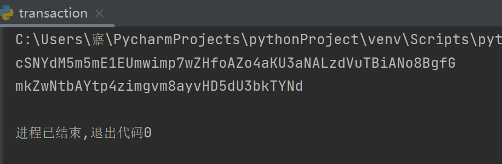
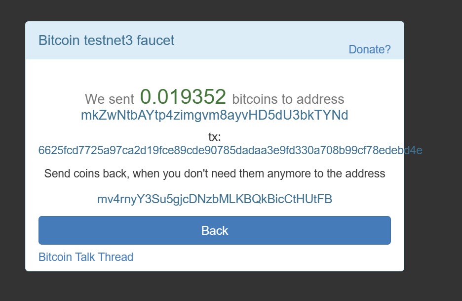
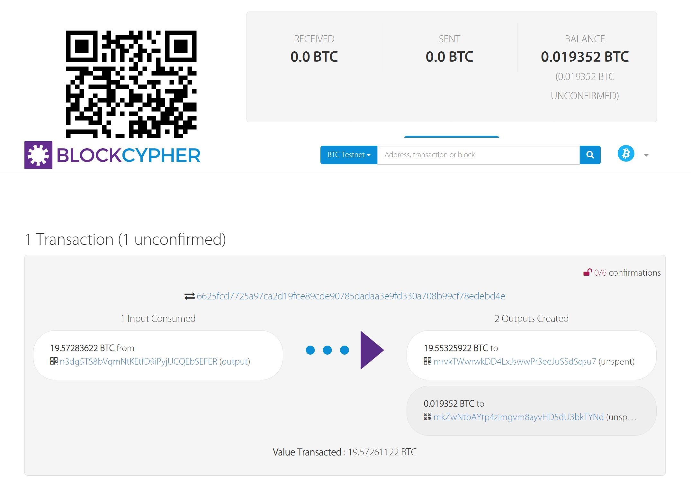
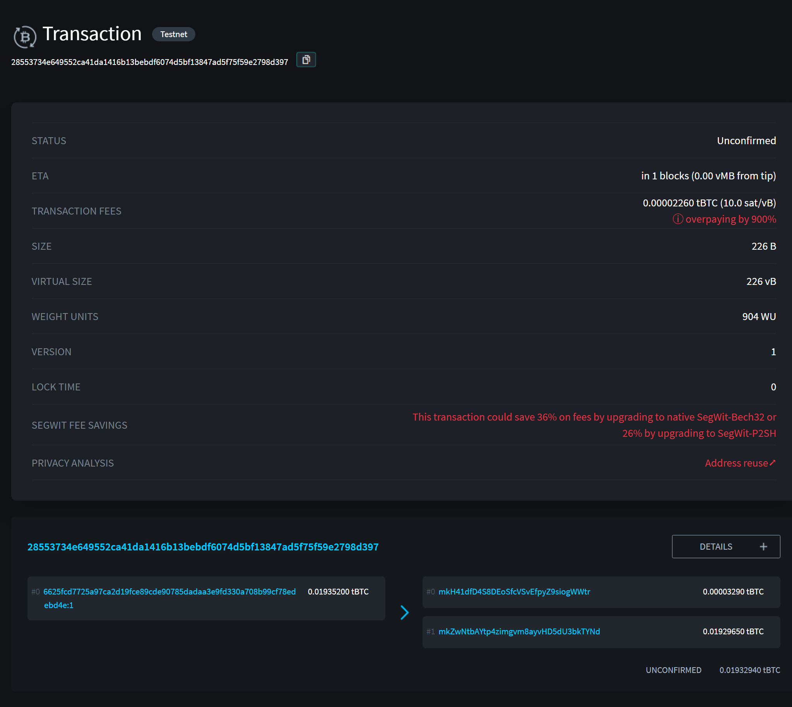

#实验介绍

### 1.1 实验名称
send a tx on Bitcoin testnet, and parse the tx data down to every bit, better write script yourself
### 1.2 实验内容
####1.2.1在比特币测试网上发布一个交易
**1.创建一个简单的测试网钱包**

代码如下：

```python
from bit import PrivateKeyTestnet
my_key = PrivateKeyTestnet()
print(my_key.to_wif())
print(my_key.address)
```
运行结果为：



通过此代码我们创建了钱包并打印 了wif值（cSNYdM5m5mE1EUmwimp7wZHfoAZo4aKU3aNALzdVuTBiANo8BgfG）和地址（mkZwNtbAYtp4zimgvm8ayvHD5dU3bkTYNd），接下来将代码改为：
```python
from bit import PrivateKeyTestnet
my_key = PrivateKeyTestnet('cSNYdM5m5mE1EUmwimp7wZHfoAZo4aKU3aNALzdVuTBiANo8BgfG')
```
使用此段代码可以保证每次重新运行都使用相同的钱包，而不是每次生成一个新钱包。
**2.获取测试比特币**
打开 https://coinfaucet.eu/en/btc-testnet ，输入刚刚得到的地址领取测试比特币。



在 https://live.blockcypher.com 输入地址可以看到以下领取结果



**3.创建交易**
对应的代码段（详见sendtx.py，已上传至仓库）为

```python
tx_hash = my_key.send([('mkZwNtbAYtp4zimgvm8ayvHD5dU3bkTYNd', 1, 'usd')])
print(tx_hash)
```
将打印出来的交易的哈希值输入到比特币测试网区块浏览器（https://blockstream.info/testnet/ ）上检查，结果如下。



####1.2.2写脚本解析交易数据
多次创建交易，并利用如下代码段（详见gettxdata.py，已上传至仓库）解析交易数据
```python
from requests_html import HTMLSession
from lxml import html
etree = html.etree
session = HTMLSession()
r = session.get('https://api.blockcypher.com/v1/btc/test3/addrs/mkZwNtbAYtp4zimgvm8ayvHD5dU3bkTYNd')
with open("txdata.txt","w",encoding='utf-8') as f:
    f.write(r.html.full_text)
```
得到的部分交易数据如下
```python
{
  "address": "mkZwNtbAYtp4zimgvm8ayvHD5dU3bkTYNd",
  "total_received": 1935200,
  "total_sent": 35481,
  "balance": 1899719,
  "unconfirmed_balance": 0,
  "final_balance": 1899719,
  "n_tx": 8,
  "unconfirmed_n_tx": 0,
  "final_n_tx": 8,
  "txrefs": [
    {
      "tx_hash": "c17497a1a810d82b274af2cfc9ac08dbbda5e26e82401addfc8cf7fed7b008a7",
      "block_height": 2440493,
      "tx_input_n": 1,
      "tx_output_n": -1,
      "value": 3320,
      "ref_balance": 1899719,
      "confirmations": 3,
      "confirmed": "2023-07-05T12:22:04Z",
      "double_spend": false
    }
```

完整的交易数据放在文件txdata.txt中。
### 1.3 参考文献
https://dev.to/nownodes/how-to-make-a-bitcoin-transaction-with-python-54k4
https://www.exchen.net/testnet-send-bitcoin.html#:~:text=%E5%9C%A8%E4%B8%BB%E7%95%8C%E9%9D%A2%E5%8F%91%E9%80%81%E5%9C%B0%E5%9D%80%E5%A1%AB%E5%86%99%E6%88%91%E4%BB%AC%E5%88%9A%E6%89%8D%E7%94%9F%E6%88%90%E7%9A%84%E5%9C%B0%E5%9D%80,tb1q8mqw9m3ahnhvq9vzz2u0ssv60n7tjfcrvqxxec%EF%BC%8C%E8%BF%99%E6%A0%B7%E7%9B%B8%E5%BD%93%E4%BA%8E%E8%87%AA%E5%B7%B1%E4%BB%98%E6%AC%BE%E7%BB%99%E8%87%AA%E5%B7%B1%EF%BC%8C%E8%AE%BE%E7%BD%AE%E4%B8%80%E4%B8%AA%E6%89%8B%E7%BB%AD%E8%B4%B9%E7%82%B9%E5%87%BB%E5%8F%91%E9%80%81%EF%BC%8C%E5%A6%82%E4%B8%8B%E5%9B%BE%E6%89%80%E7%A4%BA%E3%80%82%20%E9%99%A4%E4%BA%86%E5%9C%A8%E5%9B%BE%E5%BD%A2%E7%95%8C%E9%9D%A2%E4%B8%8A%E6%93%8D%E4%BD%9C%E5%8F%91%E9%80%81%E6%AF%94%E7%89%B9%E5%B8%81%EF%BC%8C%E8%BF%98%E5%8F%AF%E4%BB%A5%E4%BD%BF%E7%94%A8%E5%91%BD%E4%BB%A4%E5%8F%91%E9%80%81%EF%BC%8C%E5%9C%A8%E8%8F%9C%E5%8D%95%E4%B8%8A%E6%89%BE%E5%88%B0%E6%8E%A7%E5%88%B6%E5%8F%B0%E8%BE%93%E5%85%A5%E4%BB%A5%E4%B8%8B%E5%91%BD%E4%BB%A4%E3%80%82


