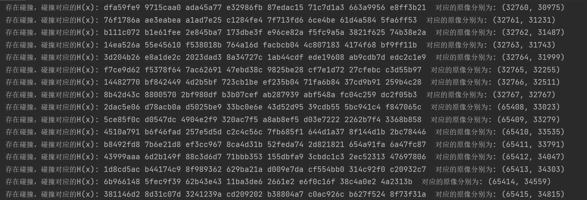

##实验介绍

### 1.1 实验名称
 implement the naïve birthday attack of reduced SM3
### 1.2 实验内容

**原理**

生日攻击：若原像的长度为nbit，则要以较高的概率找到与此原像的哈希值相同的另一原像（即碰撞），计算复杂度为$O(2^{n/2})$。在本次实验中采取以空间换取时间的方式，预计算得到长度为nbit的原像所对应的哈希值的列表，再任取另一原像计算哈希值，与列表中的值进行比较。

**实现**

```python
from SM3 import sm3_hash

def birthattack(n):
    precomputed = []
    for k in range(int(2**(n/2))):
        precomputed.append(sm3_hash(bin(k)[2:]+'1'*8))
    for m in range(int(2**(n/2))):
        hash=sm3_hash('1'*8+bin(m)[2:])
        for n in precomputed:
            if hash==n:
                print('存在碰撞，碰撞对应的H(x):', hash,'对应的原像分别为:',(precomputed.index(n),m))

birthattack(32)

```


###1.3运行结果

部分运行结果截屏：



###1.4参考文献
SM3实现：[(37条消息) 密码学 SM3算法 Python实现_python sm3_VIIoooo的博客-CSDN博客](https://blog.csdn.net/weixin_45688634/article/details/123292997)

