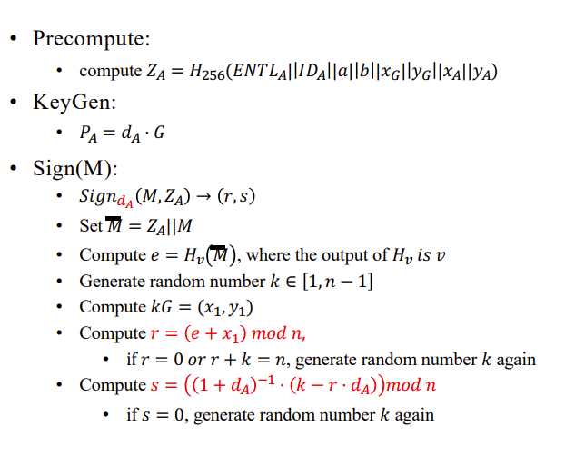
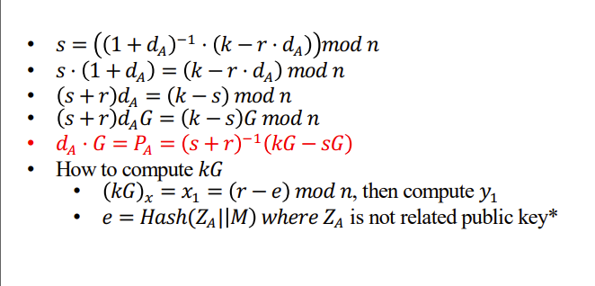

##实验介绍

### 1.1 实验名称
report on the application of this deduce technique in Ethereum with ECDSA
### 1.2 实验内容
**原理**

签名



从签名中得到公钥




**实现**

签名部分：

```python
# Sign
def sm2_RFC6979_sign(message,message_bytes):
    M1 = ZA.to_bytes((ZA.bit_length() + 7) // 8,'big') + message.encode()
    e=int(sm3.sm3_hash(list(M1)),16)
    k = k_RFC6979(message_bytes,str(hex(dA)[2:]))%n
    x1,y1 = multiply(k, G)
    r = (e+x1)%n
    s = (exgcd(1+dA,n)*(k-r*dA))%n
    return e,r,s

```
从签名中得到公钥部分：

```python
def deduce_publickey_from_signature(e,r,s):
    x1 = (r - e) % n
    y1 = Tonelli_Shanks(x1 * x1+ a * x1 + b, p)
    kG = [x1,y1]
    PA = multiply(gmpy2.invert((s+r),p),add(kG,sym_node(multiply(s,G))))
    return PA

```

代码剩余部分见.py文件

### 1.3 运行结果


