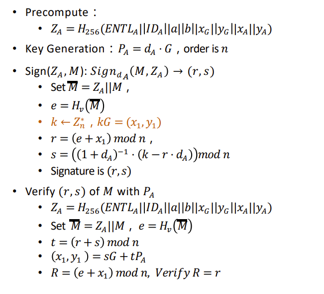
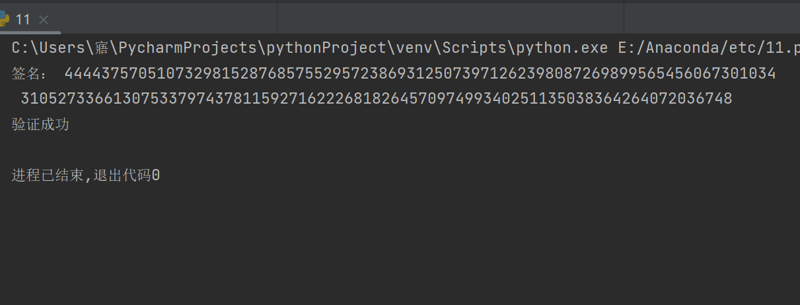

##实验介绍

### 1.1 实验名称
impl sm2 with RFC6979
### 1.2 实验内容

**原理**

注意，在本次实验中，参数k不是随机生成的，而是根据RFC6979标准生成的。具体生成过程见.py文件



**实现**

签名部分：

```python
# Sign
def sm2_RFC6979_sign(message,message_bytes):
    M1 = ZA.to_bytes((ZA.bit_length() + 7) // 8,'big') + message.encode()
    e=int(sm3.sm3_hash(list(M1)),16)
    k = k_RFC6979(message_bytes,str(hex(dA)[2:]))%n
    x1,y1 = multiply(k, G)
    r = (e+x1)%n
    s = (exgcd(1+dA,n)*(k-r*dA))%n
    return r,s

```

验证部分：

```python
# Verify
def sm2_RFC6979_verify(message,r,s):
    M1 = ZA.to_bytes((ZA.bit_length() + 7) // 8, 'big') + message.encode()
    e = int(sm3.sm3_hash(list(M1)), 16)
    t = (r+s) % n
    x2,y2 = add(multiply(s, G),multiply(t, PA))
    R = (e + x2) % n
    if R == r:
        print('验证成功')
        
```

其余部分代码均在.py文件中


###1.3运行结果




