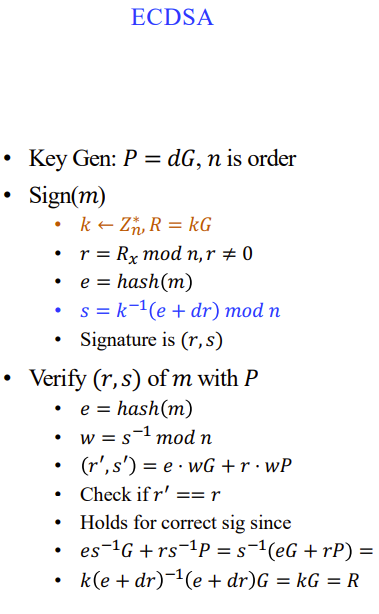
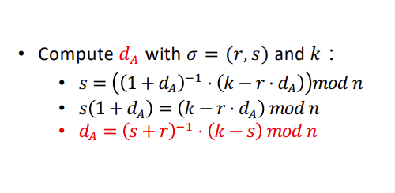
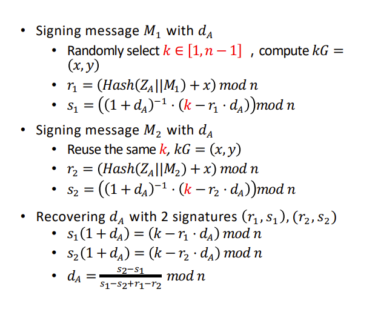
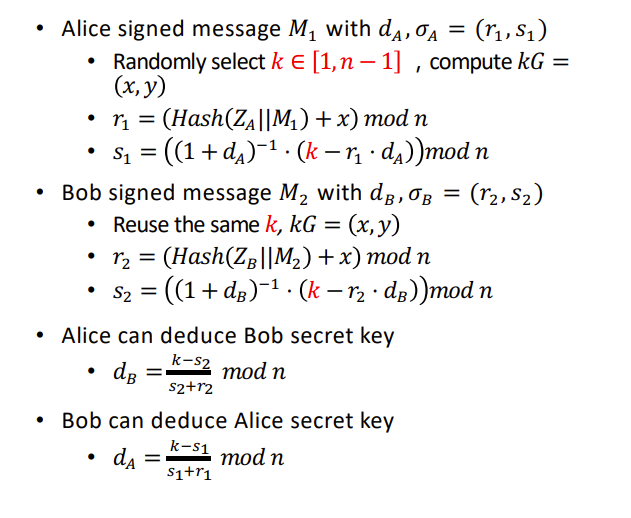
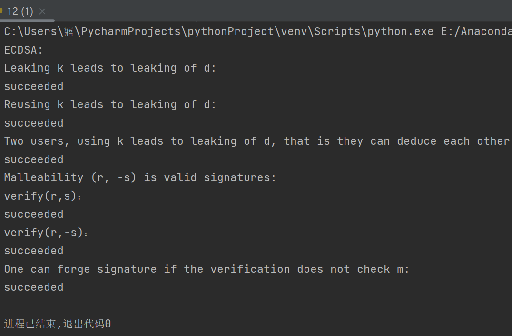

##实验介绍

### 1.1 实验名称
verify the above pitfalls with proof-of-concept code
### 1.2 实验内容
**原理**

**ECDSA上的签名与验签**

**Leaking k leads to leaking of d**

**Reusing k leads to leaking of d**

**Two users, using k leads to leaking of d, that is they can deduce each other’s d:**

**实现**

完整代码见12.py文件，对应的代码段有详细注释，不再赘叙，直接运行即可

### 1.3 运行结果

