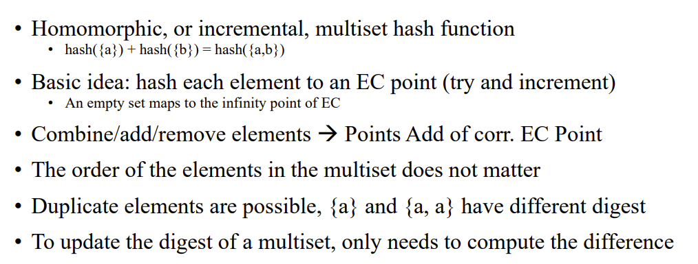
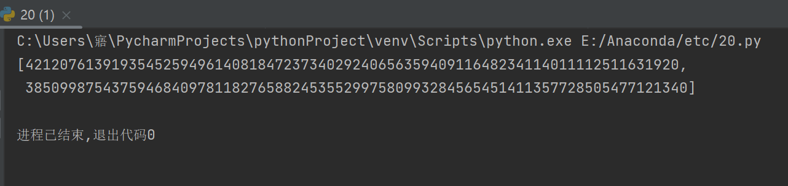

## 实验介绍

### 1.1 实验名称
ECMH PoC
### 1.2 实验内容
将集合中的元素的哈希值映射成椭圆曲线上的点，并求和

**原理**



**实现**

```python
# 将集合中的元素的哈希值映射到椭圆曲线上并求和
def map_elliptic(set):
    set_hash = 0
    for i in set:
        # 对于集合中的任一元素，先映射
        x = int(sm3.sm3_hash(list(i)), 16)
        # 已知x,根据定义的椭圆曲线方程求出y,即求解二次剩余，得到点的横纵坐标
        y = Tonelli_Shanks(x * x+ a * x + b, p)
        # 求和
        set_hash = add(set_hash, [x, y])
    return set_hash

```

其余部分代码均在.py文件中

### 1.3运行结果




