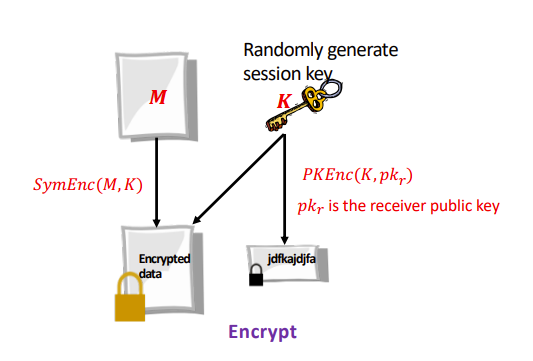
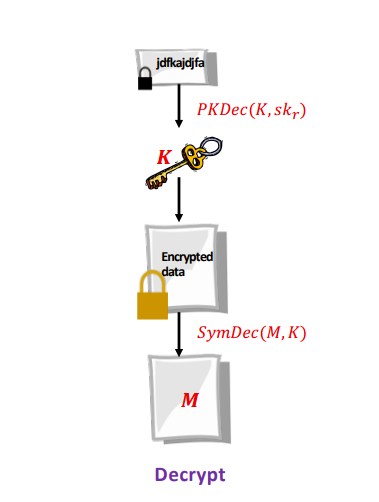
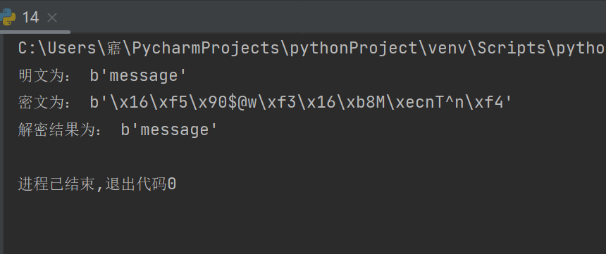

## 实验介绍

### 1.1 实验名称
 Implement a PGP scheme with SM2
### 1.2 实验内容
####1.2.1加密

对明文的加密采用对称加密，在本次实验中我选择的对称加密算法是SM4。在SM4加密过程中所使用的密钥（即会话密钥）需要通过SM2对其进行加密



代码如下：

```python
# 加密
def pgp_enc(m):
    print("明文为：",m)
    # 会话密钥
    key = b'3l5butlj26hvv313'
    # SM4加密明文
    crypt_sm4 = CryptSM4()
    crypt_sm4.set_key(key, SM4_ENCRYPT)
    c = crypt_sm4.crypt_ecb(m)
    print("密文为：",c)
    # SM2加密会话密钥
    sm2_crypt = sm2.CryptSM2(public_key=public_key, private_key=private_key)
    enc_key = sm2_crypt.encrypt(key)
    return enc_key,c
```

#### 1.2.2解密

先用SM2解密会话密钥，再利用SM4通过解密出来的会话密钥对明文进行解密




代码如下：


```python
# 解密
def pgp_dec(enc_key,c):
    # 先用SM2解密会话密钥
    sm2_crypt = sm2.CryptSM2(public_key=public_key, private_key=private_key)
    key =sm2_crypt.decrypt(enc_key)
    # 再利用SM4通过解密出来的会话密钥对明文进行解密
    crypt_sm4 = CryptSM4()
    crypt_sm4.set_key(key, SM4_DECRYPT)
    m = crypt_sm4.crypt_ecb(c) #  bytes类型
    print("解密结果为：",m)

```
#### 1.2.3运行结果



### 1.3 参考文献
[gmssl-python: GMSSL GmSSL是一个开源的加密包的python实现，支持SM2/SM3/SM4等国密(国家商用密码)算法、项目采用对商业应用友好的类BSD开源许可证，开源且可以用于闭源的商 (gitee.com)](https://gitee.com/mirrors/gmssl-python)


