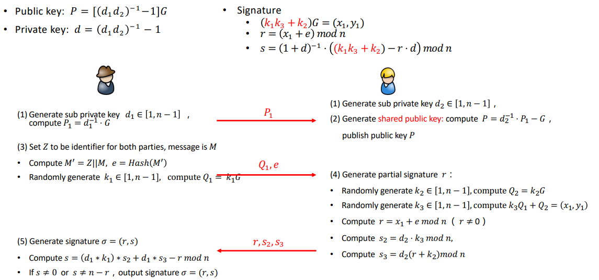
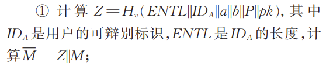
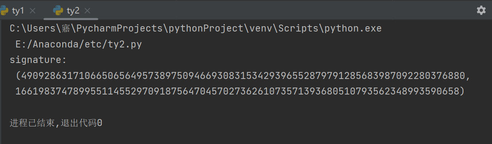

##实验介绍

### 1.1 实验名称
implement sm2 2P sign with real network communication
### 1.2 实验内容

**原理**



其中，变量Z是内容为：



**实现**

关键代码（其余部分代码均在.py文件中）如下，运行时先运行15_ty1.py文件，再运行15_ty2.py文件

```python
ID_A = 0x3AFC567D839B4982113C564472215DC973B7
ID_B = 0xF35A3C44718294C93BD84A9366C99E9F3A74
message = "message"

HOST = '192.168.0.104'
PORT = 22342
s = socket.socket(socket.AF_INET, socket.SOCK_STREAM)
s.connect((HOST, PORT))

#（1）Generate sub private key d1,compute P1
d1 = random.randint(1, n)
P1 = multiply(gmpy2.invert(d1,p),G)

s.send(str(P1).encode())
P_1 = s.recv(1024).decode()
P = json.loads(P_1)

#（3）
M = message.encode()
ENTLA = len(hex(ID_A)[2:]) #ID_A的长度
ENTLB = len(hex(ID_B)[2:]) #ID_B的长度
z = ENTLA.to_bytes((ENTLA.bit_length() + 7) // 8, 'big') + ID_A.to_bytes((ID_A.bit_length() + 7) // 8,'big') + ENTLB.to_bytes((ENTLB.bit_length() + 7) // 8, 'big') + ID_B.to_bytes((ID_B.bit_length() + 7) // 8, 'big') + a.to_bytes((a.bit_length() + 7) // 8, 'big') + b.to_bytes((b.bit_length() + 7) // 8, 'big') + Gx.to_bytes((Gx.bit_length() + 7) // 8, 'big') + Gy.to_bytes((Gy.bit_length() + 7) // 8, 'big') + P[0].to_bytes((P[0].bit_length() + 7) // 8, 'big') + P[1].to_bytes((P[1].bit_length() + 7) // 8, 'big')
Z = int(sm3.sm3_hash(list(z)), 16)
M1 = Z.to_bytes((Z.bit_length() + 7) // 8, 'big') + M
e = int(sm3.sm3_hash(list(M1)), 16)
k1 = random.randint(1, n)
Q1 = multiply(k1,G)

s.send(str(Q1).encode())
s.send(str(e).encode())
rs = s.recv(1024).decode()
r, s2, s3 = json.loads(rs)

#（5）Generate signature (r, s)
ss = (d1 * k1 * s2 + d1 * s3 - r) % n
print("signature:",(r,ss))

```

```python
HOST = '192.168.0.104'
PORT = 22342
s = socket.socket(socket.AF_INET, socket.SOCK_STREAM)
s.bind((HOST, PORT))
s.listen(5)
conn, addr = s.accept()
P1_1 = conn.recv(1024).decode()
P1 = json.loads(P1_1)

#（2） Generate shared public key
d2 = random.randint(1, n)
G1 = sym_node(G)
P = add(multiply(gmpy2.invert(d2,p), P1), G1)
conn.send(str(P).encode())

Q1_1 = conn.recv(1024).decode()
e1 = conn.recv(1024).decode()
Q1 = json.loads(Q1_1)
e = int(e1)

#（4）Generate partial signature r
k2 = random.randint(1, n)
Q2 = multiply(k2, G)
k3 = random.randint(1, n)
Q3 = add(multiply(k3, Q1),Q2)
x1 = Q3[0]
y1 = Q3[1]
r = (x1 + e) % n
s2 = (d2 * k3) % n
s3 =((r + k2) * d2) % n
conn.send(str([r, s2, s3]).encode())


```


###1.3运行结果



###1.4参考文献
http://cjc.ict.ac.cn/online/onlinepaper/009_syx-2020415163110.pdf

