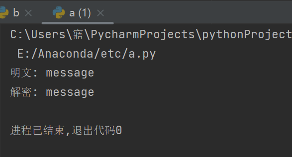

##实验介绍

### 1.1 实验名称
implement sm2 2P decrypt with real network communication
### 1.2 实验内容

**原理**


**实现**

关键代码（其余部分代码均在.py文件中）如下，运行时先运行16_t1.py文件，再运行16_t2.py文件

16_t1.py中的关键代码：

```python
P1_1 = conn.recv(1024).decode()
P1 = json.loads(P1_1)
# Generate shared public key
d2 = random.randint(1, n)
G1 = sym_node(G)
P = add(multiply(gmpy2.invert(d2,p), P1), G1)
conn.send(str(P).encode())

T1_1 = conn.recv(1024).decode()
T1 = json.loads(T1_1)
T2 = multiply(gmpy2.invert(d2,p),T1)
conn.send(str(T2).encode())

```

16_t2.py中的关键代码：

```python
d1 = random.randint(1, n)
P1 = multiply(gmpy2.invert(d1,p),G)
s.send(str(P1).encode())
P_1 = s.recv(1024).decode()
P = json.loads(P_1)

# Encrypt
C1, C2, C3 = enc(G, P)
C = C1[0].to_bytes((C1[0].bit_length() + 7) // 8, 'big') + C1[1].to_bytes((C1[1].bit_length() + 7) // 8, 'big') + C2.to_bytes((C2.bit_length() + 7) // 8, 'big') + C3.to_bytes((C3.bit_length() + 7) // 8, 'big')
if C1 != [0,0]:
    T1 = multiply(gmpy2.invert(d1,p),C1)
s.send(str(T1).encode())

T2_1 = s.recv(1024).decode()
T2 = json.loads(T2_1)
(x2,y2)=add(T2,sym_node(C1))
t = KDF(x2.to_bytes((x2.bit_length() + 7) // 8, 'big') + y2.to_bytes((y2.bit_length() + 7) // 8, 'big'), len(M) * 8)
M2 = C2 ^ t
u = int(sm3.sm3_hash(list(x2.to_bytes((x2.bit_length() + 7) // 8, 'big') + M2.to_bytes((M2.bit_length() + 7) // 8, 'big') + y2.to_bytes((y2.bit_length() + 7) // 8, 'big'))), 16)
if u == C3:
    print("解密:",M2.to_bytes((M2.bit_length() + 7) // 8, 'big').decode())

```


###1.3运行结果




