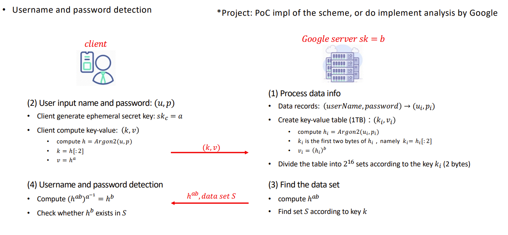
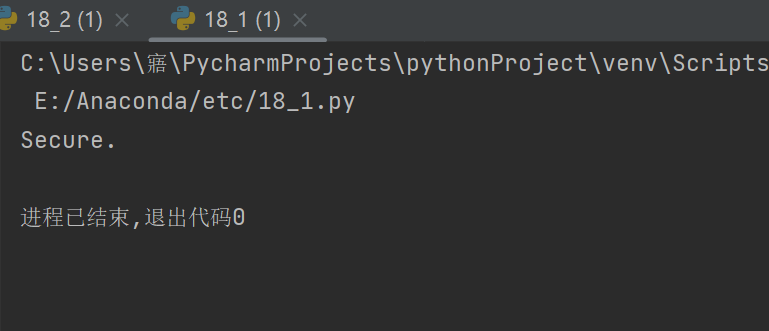

##实验介绍

### 1.1 实验名称
report on the application of this deduce technique in Ethereum with ECDSA
### 1.2 实验内容
**原理**



**实现**

运行时先运行17_2.py文件，再运行17_1.py文件

client：

```python
import random
import socket
import gmpy2
import json
from gmssl import sm3

def powermod(x,y,z):
    x = x % z
    ans = 1
    while y != 0:
        if y & 1:
            ans = (ans*x)%z
        y >>= 1
        x = (x*x) % z
    return ans

u_ = 'myc'
p_ = '202100460081'
HOST = '192.168.0.104'
PORT = 33333
p = 0x8542D69E4C044F18E8B92435BF6FF7DE457283915C45517D722EDB8B08F1DFC3
n = 0x8542D69E4C044F18E8B92435BF6FF7DD297720630485628D5AE74EE7C32E79B7
s = socket.socket()
s.connect((HOST, PORT))
address = ('192.168.0.104', 33333)

# Client generate ephemeral secret key
a = random.randint(1, n)
# Client compute key-value
h = sm3.sm3_hash(list(u_.encode() + p_.encode()))
k = h[:2]
v = powermod(int(h, 16), a, p)

s.send(k.encode())
s.send(str(v).encode())

json_string, addr = s.recvfrom(2048)
# Username and password detection
if json_string.decode() == '':
    print("Secure.")
else:
    S = json.loads(json_string)
    h_ab = int(s.recv(1024).decode())
    h_b = powermod(h_ab, gmpy2.invert(a, p), p)
    if h_b in S:
        print("Insecure.")
    else:
        print("Secure.")

```
server：

```python
import socket
import random
from gmssl import sm3

def powermod(x,y,z):
    x = x % z
    ans = 1
    while y != 0:
        if y & 1:
            ans = (ans*x)%z
        y >>= 1
        x = (x*x) % z
    return ans
HOST = '192.168.0.104'
PORT = 33333
p = 0x8542D69E4C044F18E8B92435BF6FF7DE457283915C45517D722EDB8B08F1DFC3
n = 0x8542D69E4C044F18E8B92435BF6FF7DD297720630485628D5AE74EE7C32E79B7
s = socket.socket()
s.bind((HOST, PORT))
s.listen(1)
address = ('192.168.0.104', 33333)

# Process data info
# Data records:
userNme=[]
password=[]
for i in range(50):
    digit_letter = '0123456789abcdefghigklmnopqrstuvwxyzABCDEFGHIJKLMNOPQRSTUVWXYZ'
    ui_ = [random.choice(digit_letter) for i in range(8)]
    pi_ = [random.choice(digit_letter) for i in range(8)]
    ui = ''.join(ui_)
    pi = ''.join(pi_)
    userNme.append(ui)
    password.append(pi)

# Create key-value table
S = []
b = random.randint(1,n)
for i in range(50):
    hi = sm3.sm3_hash(list(userNme[i].encode() + password[i].encode()))
    ki = hi[:2]
    vi = powermod(int(hi, 16), b, p)
    S.append([ki,vi])

conn, addr = s.accept()
k = conn.recv(1024).decode()
v = int(conn.recv(1024).decode())

# Find the data set
h_ab = powermod(v, b, p)
# Find set S according to key k
if (k, v) in S:
    json_string = json.dumps(S)
    s.sendto(json_string.encode(), address)
    conn.send(str(h_ab).encode())

```


### 1.3 运行结果


