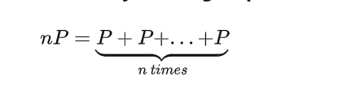

##实验介绍

### 1.1 实验名称
forge a signature to pretend that you are Satoshi
### 1.2 实验内容
####1.2.1使用椭圆曲线数字签名算法（ECDSA）完成数字签名
**原理**


**实现**

```python
# 选取椭圆曲线y^2=x^3+2*x+3，基点G为(3,6)，阶为5
a = 2
b = 3
p = 97
G = [3, 6]
n = 5

m = 'waittosign'
#Key Gen
d = random.randint(1, n - 1)
P = multiply(d, G)

# Sign(m)
def sign(m):
    k = random.randint(1, n - 1)
    R = multiply(k, G)
    r = R[0] % n
    e = hash(m)
    s = (exgcd(k, n) * (e + d * r)) % n
    print("原始签名为:", r, s)
    return r, s

```


####1.2.2验证签名

**原理**


**实现**

```python
# Verify (r, s) of m with P
def verify(r, s):
    e = hash(m)
    w = exgcd(s, n)
    r1,s1 = add(multiply((e * w) % n, G), multiply((r * w) % n, P))
    if (r1 % n == r):
        print('验证成功')
    else:
        print('验证失败')
```


####1.2.3伪造签名

**原理**


**实现**

```python
# Forge a signature
def forge_signature(n,G,P):
    u = random.randint(1, n - 1)
    v = random.randint(1, n - 1)
    x1,y1 = add(multiply(u, G), multiply(v, P))
    r1 = x1 % n
    e1 = (r1 * u * exgcd(v, n)) % n
    s1 = (r1 * exgcd(v, n)) % n
    #对伪造的签名进行验证
    w = exgcd(s1, n)
    r2,s2 = add(multiply((e1 * w) % n, G), multiply((r1 * w) % n, P))
    if (r2 % n == r1):
        print('伪造成功')
    else:
        print('伪造失败')

```


#### 1.2.4关于椭圆曲线上的加法和乘法

**原理**

加法：


乘法：



**实现**

```python
# 求逆
def exgcd(a, b):
    x1_1, x1_2, x1_3 = 1, 0, a
    x2_1, x2_2, x2_3 = 0, 1, b
    while x2_3 != 0:
        temp = x1_3 // x2_3
        t1, t2, t3 = x1_1 - temp * x2_1, x1_2 - temp * x2_2, x1_3 - temp * x2_3
        x1_1, x1_2, x1_3 = x2_1, x2_2, x2_3
        x2_1, x2_2, x2_3 = t1, t2, t3
    return x1_1 % b

# 加法
def add(P1, P2):
    if P1 == 0:
        return P2
    if P2 == 0:
        return P1
    if P1 != P2:
        lam = ((P1[1] - P2[1]) * exgcd(P1[0] - P2[0], p)) % p
    else:
        lam = ((3 * (P1[0] ** 2) + a) * exgcd(2 * P1[1], p)) % p

    x = (lam * lam - P1[0] - P2[0]) % p
    y = (lam * (P1[0] - x) - P1[1]) % p
    z = [x, y]
    return z

# 乘法
def multiply(t, g):
    outc = 0
    if t == 0:
        return 0
    else:
        for i in range(0,t):
            outc = add(outc, g)
        return outc
```


####1.2.5运行结果


### 1.3 参考文献

[椭圆曲线密码学简介（二）：有限域的椭圆曲线及离散对数问题 - 知乎 (zhihu.com)](https://zhuanlan.zhihu.com/p/104531745)


