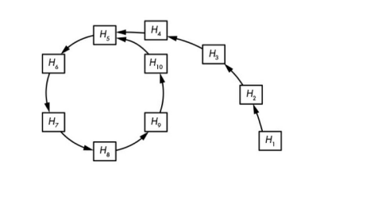
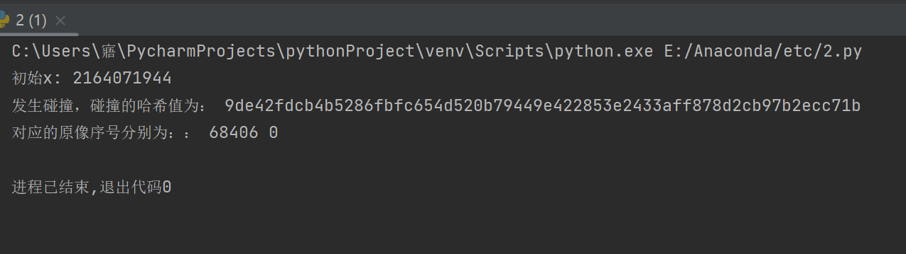

## 代码运行指导：需将SM3.py文件与2.py文件放在同一目录下，再运行2.py文件

### 1.1 实验名称
 implement the Rho method of reduced SM3
### 1.2 实验内容

**原理**

随机生成长为32bi的原像x，计算哈希值（SM3加密算法），再对得到的哈希值继续进行哈希，不断重复上述过程，若计算出的哈希值已经在哈希值链中，则发生碰撞；否则，就将计算出的哈希值添入链中。



**实现**

```python
import random
from SM3 import sm3_hash
from gmssl import sm3

def rho_method():
    hashlist = []
    x = random.randint(0, 2**32) #原像长为32bit，
    print('初始x:',x)
    x_1 = sm3_hash(bin(x)[2:]).replace(" ","")
    hashlist.append(x_1)
    while(True):
        bin_str = ""
        for n in hashlist[-1]:
            bin_str += bin(int(n, 16))[2:].zfill(4)
        x_2 = sm3_hash(bin_str).replace(" ","")
        for i in hashlist:
            if x_2[0:4]==i[0:4]:
                return i,hashlist.index(hashlist[-1]),hashlist.index(i)
            else:
                hashlist.append(x_2)
                break

m,x1,x2=rho_method()
print('发生碰撞，碰撞的哈希值为：', m)
print('对应的原像序号分别为：：', x1, x2)
```

### 1.3 运行结果



