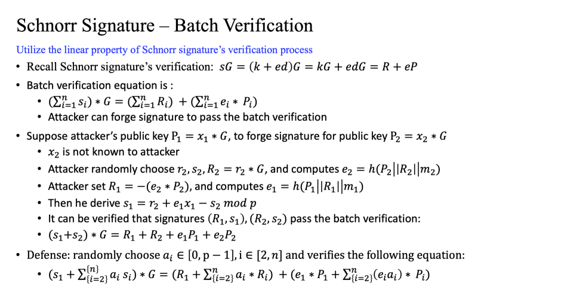
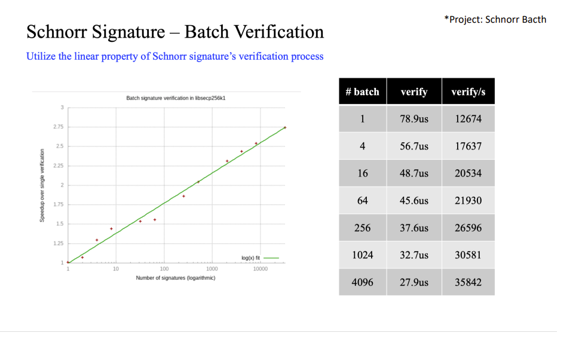
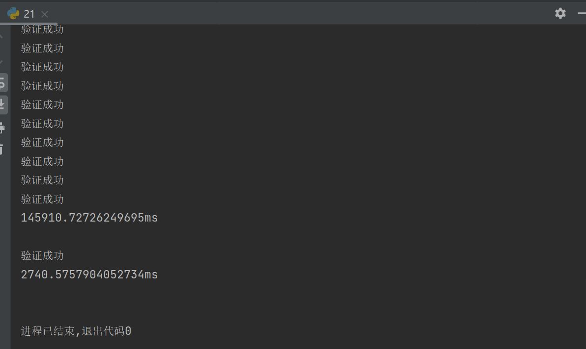

## 实验介绍

### 1.1 实验名称
Schnorr Bacth
### 1.2 实验内容
**原理**






**实现**

关键部分代码：

```python
def Verify1(R,s,e):
    if multiply(s, G) == add(R,multiply(e, P)):
        print('验证成功')
    else:
        print('验证失败')


def Verify2(R1,s1,e1):
    s = 0
    for i in s1:
        s = s + i
    e = 0
    for j in e1:
        e = e + j
    R = 0
    for k in R1:
        R = add(R , k)

    if multiply(s, G) == add(R,multiply(e, P)):
        print('验证成功')
    else:
        print('验证失败')

set=[]
for i in range(64):
    M = ''.join(random.sample(string.ascii_letters + string.digits, 8)).encode()
    set.append(M)
R_set=[]
s_set=[]
e_set=[]
for i in set:
    R_,s_,e_=sign(i)
    R_set.append(R_)
    s_set.append(s_)
    e_set.append(e_)

time_start1 = time.time()
for j in range(64):
    Verify1(R_set[j], s_set[j], e_set[j])
time_end1 = time.time()
time_cost1 = (time_end1 - time_start1) * 1000
print(str(time_cost1) + "ms\n")

time_start2 = time.time()
Verify2(R_set,s_set,e_set)
time_end2 = time.time()
time_cost2 = (time_end2 - time_start2) * 1000
print(str(time_cost2)+ "ms\n")


```

其余部分代码均在.py文件中

### 1.3运行结果

第一个时间是对64组签名分别进行验证所需要的时间，第二个时间是使用批量验证方法验证所需要的时间




