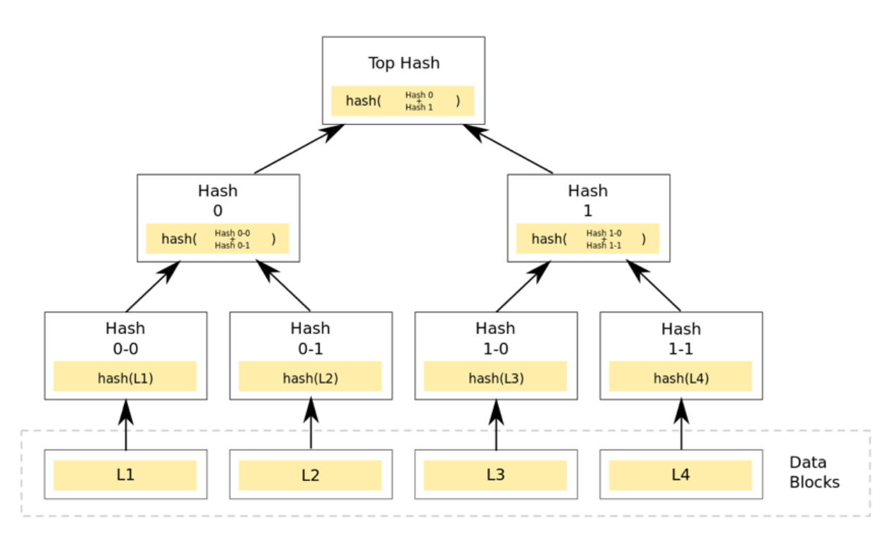

## Merkle Patricia Trie

### 1.概念

Merkle Patricia Tree融合了默克尔树和前缀树的结构优点，被用来组织管理账户数据、生成交易集合哈希。（默克尔树和前缀树的具体内容见最后）

### 2.结构介绍

结构示意图

#### 2.1前缀树

前缀树的每个节点是一个确定长度的数组，存储了指向子节点的指针。

前缀树的键（key）通常是字符串，由节点的位置决定 ：根节点对应空字符串，一个节点的所有子节点都有相同的前缀，即这个节点对应的字符串。不是所有的节点都有对应的值（value），只有叶子节点和部分内部节点所对应的键才有相关的值。

优势：使用前缀树来进行查询拥有共同前缀key的数据时十分高效。但是对于最差的情况（前缀为空串），时间效率为O(n)，仍然需要遍历整棵树。

劣势：直接查找效率低下；可能会造成空间浪费（当节点的key值很长且树中没有相同前缀的分支时）

#### 2.2默克尔树

默克尔树的叶子节点的值（value）是数据项或数据项的哈希值，非叶子节点的值（value）是子节点的信息的哈希值：将子节点的哈希值合并，计算合并后的字符串的哈希值作为value。

优势：快速重哈希（节点变化时，在前一次哈希计算的基础上对被修改节点进行哈希重计算，就能得到一个新的根哈希）；轻节点扩展（每个区块仅需存储约80个字节大小的区块头，不存储交易列表，回执列表等数据，并可在非信任的公链环境中验证某一笔交易是否被收录在区块链账本中）

劣势：存储空间开销大

#### 2.3 节点分类

##### 1.空节点：

空字符串。

##### 2.分支节点：

有超过1个子节点以上的非叶子节点。

其中key被编码成一种特殊的16进制表示（将一个字节的高低四位内容分拆成两个字节存储。通过编码转换，key的每一位的值范围都在[0, 15]），加上value，所以分支节点是一个长度为17的list。

如果有一个[key,value]对在这个分支节点终止，最后一个元素代表一个值 ，即分支节点既可以搜索路径的终止也可以是路径的中间节点。

每个分支节点有一个附带的字段nodeFlag，记录了一些辅助数据：

- 节点哈希：若该字段不为空，则当需要进行哈希计算时，可以跳过计算过程而直接使用上次计算的结果（当节点变脏时，该字段被置空）；
- 脏标志：当一个节点被修改时，该标志位被置为1；
- 诞生标志：当该节点第一次被载入内存中（或被修改时），会被赋予一个计数值作为诞生标志，该标志会被作为节点驱除的依据，清除内存中“太老”的未被修改的节点，防止占用的内存空间过多；

##### 3.叶子节点：

表示为 [key,value]的一个键值对，其中key是key的一种特殊十六进制编码， value是RLP编码。

##### 4.扩展节点

表示为[key，value]的一个键值对 ，这里的 value是其他节点的hash值 ，可以被用来查询数据库中的节点（通过hash链接到其他节点）

#### 2.4 路径压缩

前缀树中会出现严重的存储空间浪费的情况：图中右侧节点只是用来构建路径，目的是为了存储该路径上的叶子节点。

优化：试图插入节点时，若目前没有与该节点key相同前缀的路径，把剩余的key存储在叶子／扩展节点的key字段中。

例子：红线所圈节点和紫色线所圈的节点共享前缀t，但是在紫色线所圈的节点插入时，没有与oast有共同前缀的路径，因此设置key为oast，实现了编码路径的压缩。

### 3.操作

#### 3.1查找——Get

若当前节点为叶子节点，存储的内容是数据项的内容，且搜索路径的内容与叶子节点的key一致，则表示找到该节点；反之则表示该节点在树中不存在。

若当前节点为扩展节点，且存储的内容是哈希索引，则利用哈希索引从数据库中加载该节点，再将搜索路径作为参数，对新解析出来的节点递归地调用查找函数。

若当前节点为扩展节点，存储的内容是另外一个节点的引用，且当前节点的key是搜索路径的前缀，则将搜索路径减去当前节点的key，将剩余的搜索路径作为参数，对其子节点递归地调用查找函数；若当前节点的key不是搜索路径的前缀，表示该节点在树中不存在。

若当前节点为分支节点，若搜索路径为空，则返回分支节点的存储内容；反之利用搜索路径的第一个字节选择分支节点的孩子节点，将剩余的搜索路径作为参数递归地调用查找函数

#### 3.2插入——Insert
查找与新插入节点拥有最长相同路径前缀的节点。

若该节点为分支节点：
（1）剩余的搜索路径不为空，则将新节点作为一个叶子节点插入到对应的子节点列表中；
（2）剩余的搜索路径为空，则将新节点存储在分支节点的第17个子节点中；
若该节点为叶子／扩展节点：
（1）剩余的搜索路径与当前节点的key一致，更新当前节点的value；
（2）剩余的搜索路径与当前节点的key不完全一致，则将叶子／扩展节点的子节点替换成分支节点，将新节点与当前节点key的共同前缀作为当前节点的key，将新节点与当前节点的子节点作为两个孩子插入到分支节点的孩子列表中，同时当前节点转换成了一个扩展节点（若新节点与当前节点没有共同前缀，则直接用生成的分支节点替换当前节点）；

若插入成功，则将被修改节点的脏标志置为true，节点哈希标志置空，诞生标记更新为现在。

#### 3.3删除——Delete
查找与待删除的节点拥有最长相同路径前缀的节点。

若该节点为分支节点：
（1） 删除子节点列表中相应下标标志的节点；
（2） 删除结束，若该节点的子节点个数只剩下一个，那么将分支节点替换成一个叶子／扩展节点；

若该节点为叶子／扩展节点：
（1）若剩余的搜索路径与该节点的key完全一致，删除整个节点；
（2）若剩余的搜索路径与该节点的key不匹配，表示需要删除的节点不存于树中，删除失败；
（3）若key是剩余搜索路径的前缀，则对该节点的value做递归的删除调用；

删除后，将被修改节点的脏标志置为true，hash标志置空（之前的结果已经不可能用），且将节点的诞生标记更新为现在；

#### 3.4更新——Update

进行更新时，若value不为空，转为调用插入；若value为空，转为调用删除。

#### 3.5提交——Commit

用于将内存中的MPT数据持久化到数据库的功能。

#### 单节点提交：

1.若节点未被修改，直接返回该节点的哈希值，同时判断节点是否过老，若过老则将以该节点为根节点的子树从内存中删除；若该节点为脏节点，则进行哈希重计算。

2.对当前节点的RLP编码进行哈希计算；

3.将当前节点的数据存入数据库，存储的格式为[节点哈希值，节点的RLP编码]；

4.将自身的脏标志位置为false，将计算所得的哈希值进行缓存。

一次MPT树提交是一个递归调用的过程：以根节点为入口，对根节点进行提交调用。

提交完成后，所有脏标志置为true的节点会重新进行哈希计算，并且将新内容写入数据库；新的根节点哈希将被作为MPT的最新状态被返回。

实现功能：快速计算所维护数据集哈希标识；快速状态回滚

### 4.补充

#### 4.1key值编码

##### 1.Raw编码：
规则：原key值

##### 2.Hex编码：
规则：将原key的高低四位分拆成两个字节进行存储。若该节点是叶子节点，在末位添加一个ASCII值为16的字符作为终止标志符；若该节点是扩展节点，不加任何字符。

##### 3.HP (Hex-Prefix)编码
对存储在数据库中的叶子／扩展节点的key进行编码区分。
规则：若该节点是叶子节点，去掉末尾字节；若原本key的长度为奇数，则在key之前再增加一个值为0x0的半字节；将原本key以高4位低4位进行划分，存储在一个字节中（Hex扩展的逆）；
在key之前增加一个半字节，其中最低位用来编码原本key长度的奇偶信息，key长度为奇数，则该位为1；低2位中编码一个特殊的终止标记符，若该节点为叶子节点，则该位为1；

#### 4.2作用：
1.存储任意长度的[key,value]键值对；
2.提供了一种快速计算所维护数据集哈希标识的机制；
3.提供了快速状态回滚的机制；
4.提供了一种称为默克尔证明的证明方法，进行轻节点的扩展，实现简单支付验证；

### 5.代码实现
具体代码实现见.cpp文件，运行时需下载openssl库

运行结果：

### 6.参考文献
https://zhuanlan.zhihu.com/p/46702178
https://blog.csdn.net/qq_40713201/article/details/124486307

