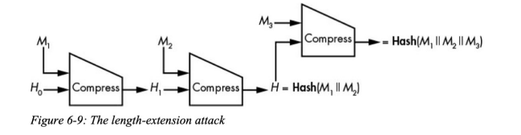
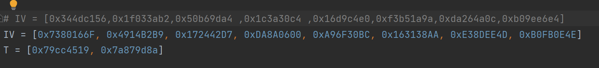
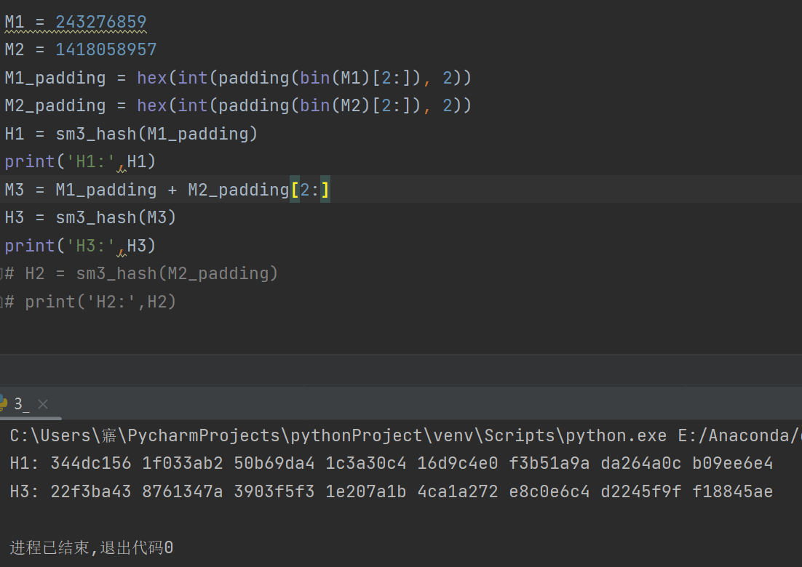
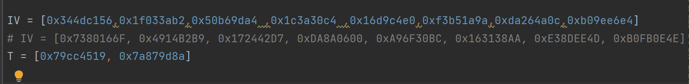
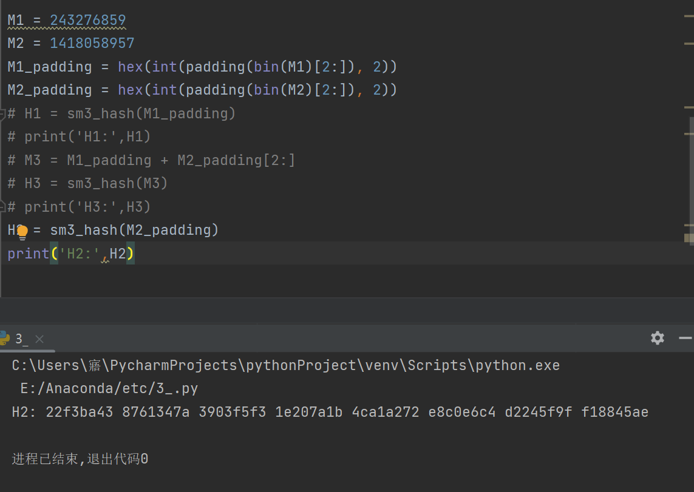

## 代码运行指导：需将SM3.py与3.py放在同一目录下，再运行3.py，运行时需按照步骤注释掉相应代码

## 实验介绍

### 1.1 实验名称
 implement length extension attack for SM3, SHA256, etc.
### 1.2 实验内容

**原理**

给定M1，M2，计算H1=hash(M1,IV)（IV为默认值），H2=hash(M2,H1)，再计算H3=hash(M1||M2,IV)，若H2=H3，则说明攻击成功.

**实现**

1.IV取默认值，求出H1，H3

2.将IV替换为H1的值，注释掉求H1和H3的代码，求出H2

3.对比发现H2与H3的值相同，攻击成功.

### 1.3参考文献
SM3实现：[(37条消息) 密码学 SM3算法 Python实现_python sm3_VIIoooo的博客-CSDN博客](https://blog.csdn.net/weixin_45688634/article/details/123292997)

