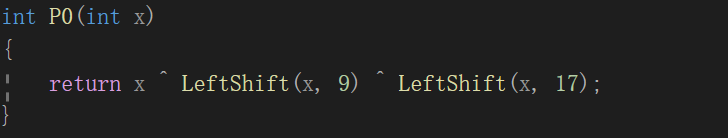

##代码运行指导：需将SM3.py与3.py放在同一目录下，再运行3.py，运行时需按照步骤注释掉相应代码

##实验介绍

### 1.1 实验名称
do your best to optimize SM3 implementation (software)
### 1.2 实验内容

**思路**
1.减少函数调用
函数调用有更多的压栈出栈操作，比直接运算耗时更长。
例如，P0函数只调用了一次：



于是将代码改为：


同理，T函数也进行如上操作

2.利用SIMD指令

（1）利用SIMD指令对中间函数进行优化

例如：对P1函数进行优化

```python
__m128i P1(__m128i x)
{
    __m128i y = _mm_xor_si128(_mm_xor_si128(x, tranleft(x, 15)), tranleft(x, 23));
    return y;
}
```

（2）利用SIMD指令将循环部分展开

```python
void CF(int* V, int* BB) 
{
    int w[68];int h[64];
    __m128i v12, v6, v9, v3, v0, s;
    for (int i = 0; i < 16; i++) w[i] = Reverse(BB[i]);
    for (int k = 4; k < 17; k++)
    {
        int x = w[k * 4 - 16] ^ w[k * 4 - 9] ^ (LeftShift(w[k * 4 - 3], 15));
        w[k * 4] = (x ^ LeftShift(x, 15) ^ LeftShift(x, 23)) ^ LeftShift(w[4 * k - 13], 7) ^ w[4 * k - 6];
        v0 = _mm_setr_epi32(w[4 * k - 3], w[4 * k - 2], w[4 * k - 1], w[4 * k]);
        v3 = _mm_setr_epi32(w[4 * k - 6], w[4 * k - 5], w[4 * k - 4], w[4 * k - 3]);
        v6 = _mm_setr_epi32(w[4 * k - 9], w[4 * k - 8], w[4 * k - 7], w[4 * k - 6]);
        v9 = _mm_setr_epi32(w[4 * k - 13], w[4 * k - 12], w[4 * k - 11], w[4 * k - 10]);
        v12 = _mm_setr_epi32(w[4 * k - 16], w[4 * k - 15], w[4 * k - 14], w[4 * k - 13]);
        s = _mm_xor_si128(P1(_mm_xor_si128(tranleft(v9, 7), v3)), _mm_xor_si128(_mm_xor_si128(v12,v6), tranleft(v0, 15)));
        memcpy(&w[k * 4], (int*)&s, 16);        
    }
    for (int i = 0; i < 64; i++)  h[i] = w[i] ^ w[i + 4];
    int A = V[0], B = V[1], C = V[2], D = V[3], E = V[4], F = V[5], G = V[6], H = V[7];
    for (int i = 0; i < 64; i++) {
        int T[2] = { 0x7a879d8a ,0x79cc4519 };
        int t;
        if (i < 0 || i >15)t = T[0];
        else t=T[1];
        int SS1 = LeftShift(LeftShift(A, 12) ^ E ^ LeftShift(t, i % 32), 7);
        int SS2 = SS1 ^ LeftShift(A, 12);
        int TT1 = FF(A, B, C, i) ^ D ^ SS2 ^h[i];
        int TT2 = GG(E, F, G, i) ^ H ^ SS1 ^ w[i];
        D = C;
        C = LeftShift(B, 9);
        B = A;
        A = TT1;
        H = G;
        G = LeftShift(F, 19);
        F = E;
        E = TT2^ LeftShift(TT2, 9) ^ LeftShift(TT2, 17);

    }
    V[0] = A ^ V[0]; V[1] = B ^ V[1]; V[2] = C ^ V[2]; V[3] = D ^ V[3]; V[4] = E ^ V[4]; V[5] = F ^ V[5]; V[6] = G ^ V[6]; V[7] = H ^ V[7];
}
```


###1.3运行结果

**可以看到明显的优化效果**

Not_optimized.cpp：


optimized.cpp：


