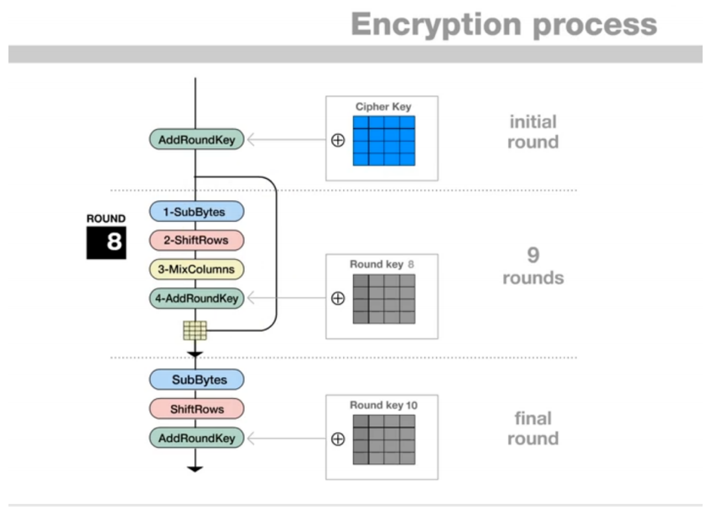
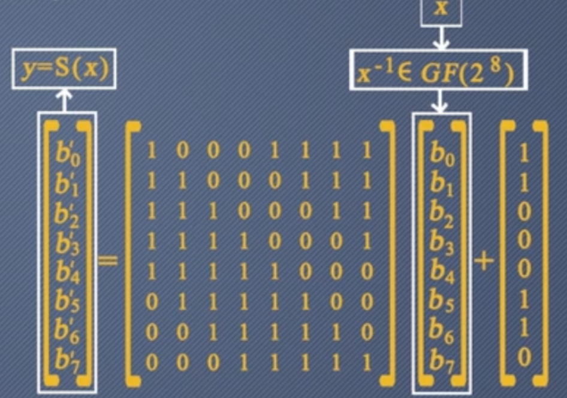
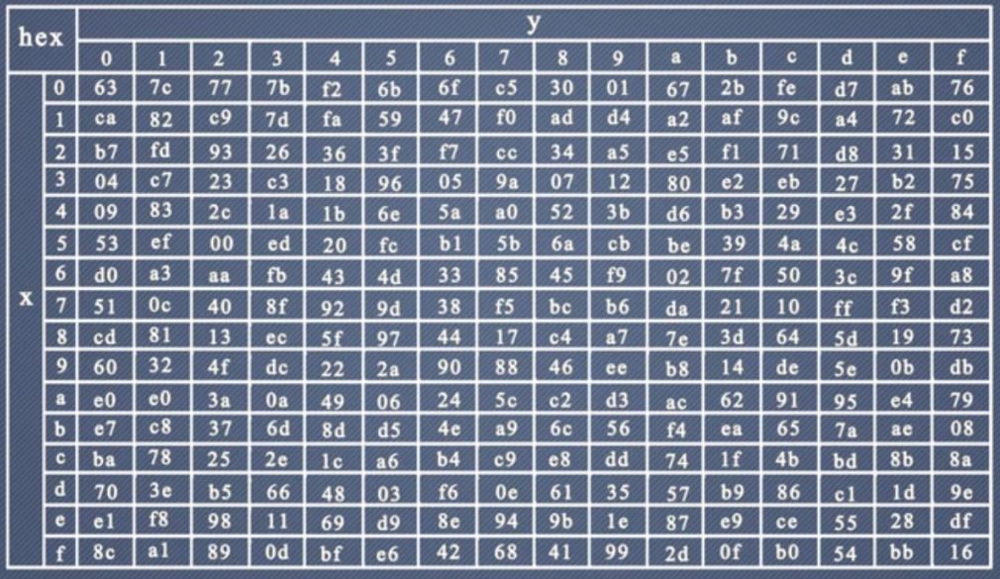
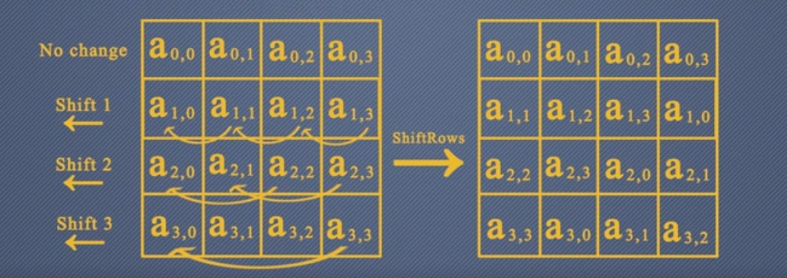
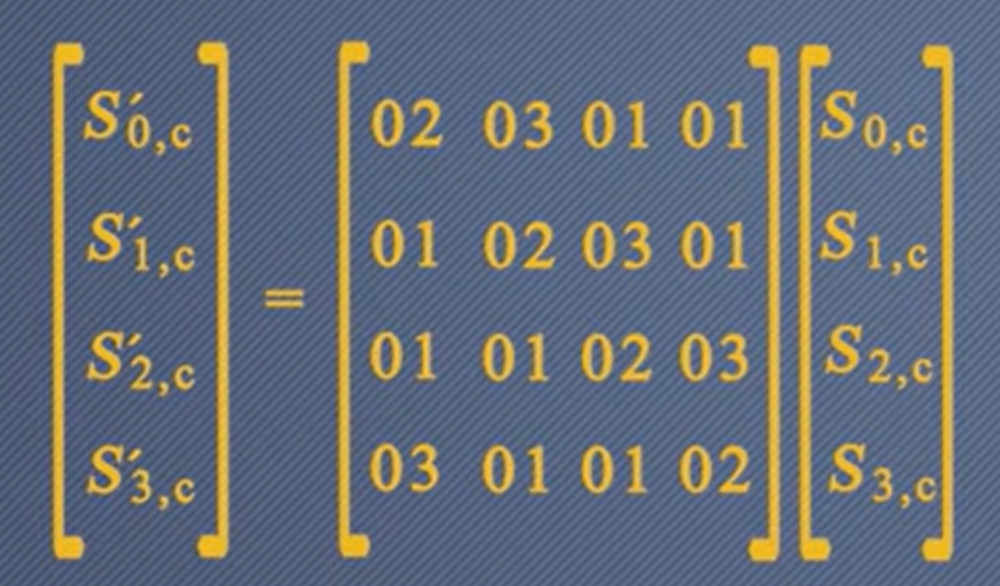
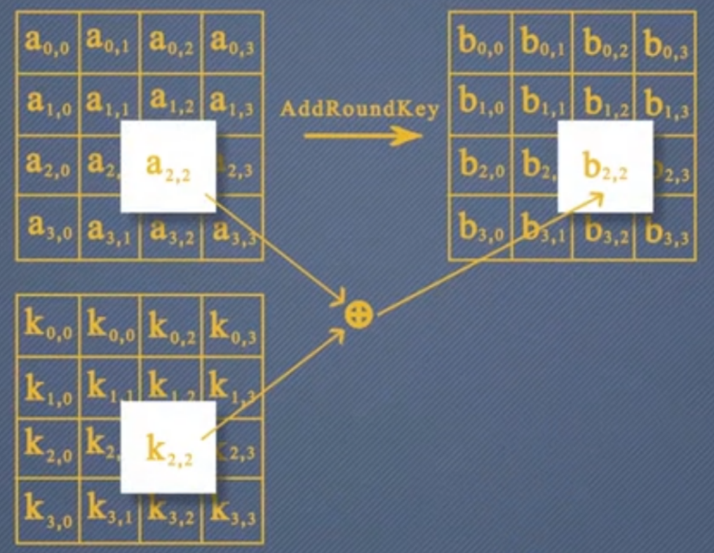
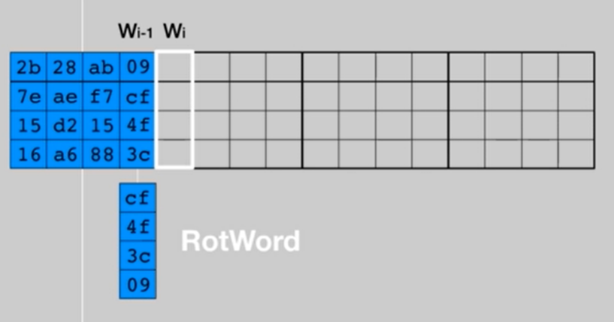
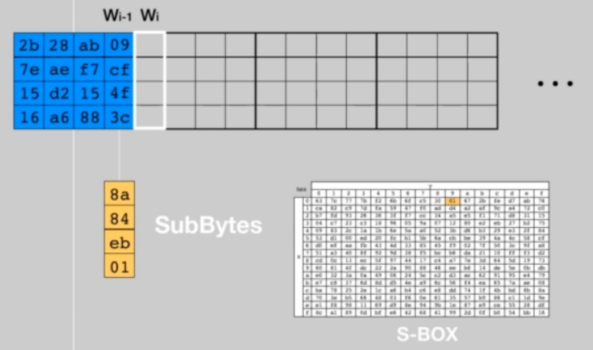
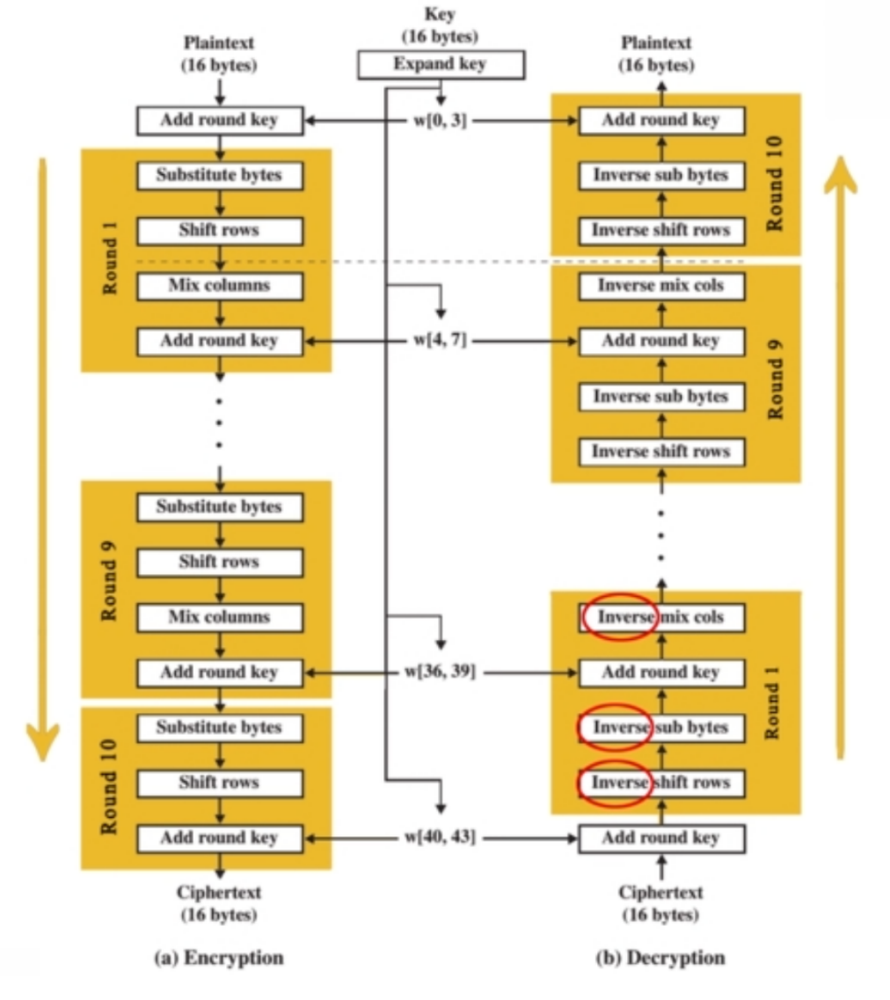
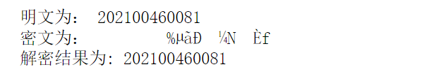

##**代码运行说明：完整代码已在报告中给出（见报告末尾），使用SageMath运行代码**

# 一、AES密码的原理

## 2.1 **AES的加密过程**

AES使用SPN结构。 加密轮数依赖于密钥长度：128比特密钥对应10轮，192比特密钥对应12轮，256比特对应14轮。

对于AES-128加密算法而言，在第一轮开始前，将明文与密钥进行异或，然后进行9轮迭代的操作，每一轮中包括4个不同的变换：字节代替（SubBytes）、行移位（ShiftRows）、列混淆（MixColumns）和轮密钥加（AddRoundKey）。最后一轮仅包含三个变换：字节代替（SubBytes）、行移位（ShiftRows）和轮密钥加（AddRoundKey）。

加密过程如图所示：



***

###字节替代（SubBytes）

本质为查表操作。AES定义了一个S盒，并使用S盒对每个字节进行替换，替换规则为：高4位作为行值，低4位作为列值，从S盒的对应位置取出元素作为替换。

16个字节均采用相同的S盒，S盒是AES算法中唯一的非线性部件。

####S盒的构造

（一）选取原则：

​		1.非线性度：

​			相关度：输入输出的相关度越小越好。

​			差分传播概率:最大差分传播概率越小越好。

​		2.代数复杂度：

​			布尔函数的代数表达式必须复杂。

​		3.可逆

（二）构造方式

​		1.在GF($2^{8}$)上，对8比特的输入$x$求逆$x^{-1}$( $x$*$x^{-1}$=1 (mod $x^{8}$+$x^{4}$+$x^{3}$+$x$+1) )。

​		2.经过在GF(2)上的仿射变换，如图：



将每种可能输入均通过该过程进行计算，得到S盒。



##行移位（ShiftRow）

每一行按字节循环移位，第一行循环左移0个字节，第二行<<<1，第三行<<<2,第四行<<<3，使得某一列的四个字节扩散到4列。



##列混合（MixColumn）

以列为单位，使得输出的每一个字节和输入的四个字节有关。

具体实现：



做GF($2^{8}$)上的乘法，模不可约多项式$m(x)$的乘法运算，$m(x)$=$x^{8}$ +$x^{4}$ +$x^{3}$ +$x$ +1

其中：


此外，列混合变换的矩阵中的数字选取了{01}{02}{03}，加密速度较快。一般情况下，加密比解密更重要，设计算法时，优先保证加密的效率。例如：

　　1、CFB和OFB工作模式，只采用加密算法

　　2、部分消息认证码MAC的构造只用到加密过程

## 添加轮密钥（AddRoundKey）

每个字节与轮密钥的对应字节进行异或运算



## 密钥扩展方案

需要将128比特的主密钥扩展为44个32比特字。首先将主密钥转化为4个32 bits的字，分别记为$W_{0}$，$W_{1}$，$W_{2}$，$W_{3}$，接下来通过下述步骤求出各轮的轮密钥。

1.将上一轮轮密钥的最后一列$W_{i-1}$循环左移一个字节。



2.将结果中的每个字节依次经过S盒的查表



3.查表后得到的结果与$W_{i-4}$、以及一个32 bits的常量（常量矩阵见下图）以及进行异或，就能得到该轮轮密钥的第一列。


4.每一轮轮密钥的第一列使用上述方法求出，其余二、三、四列都直接通过异或运算得到。$W_{i}$=$W_{i-4}$⊕$W_{i-1}$，后续每一轮均按照此步骤进行处理。

##2.2 **AES的解密过程**

AES使用SPN结构，加解密函数不同。除了异或密钥，S盒、行移位、列混合都为原先的逆运算，密钥逆序使用。

加解密对照：




## 2.3 AES密码的安全性分析

​		在轮密钥的产生过程中，我们可以看出，若知道扩展密钥的连续128个及以上的密钥字，就能重新生成整个扩展密钥;但是，若少于128个，则不能计算主密钥的全部比特。使用轮常数是为了排除每一轮轮密钥的对称性，主密钥的每个位影响轮密钥的某些位，把轮密钥的一位与主密钥的若干位建立起关系。把具有非线性性的S盒引入密钥扩展算法，提高了密钥的安全性。

**雪崩效应**：改变明文1比特信息，在两轮加密后，输出的改变量基本稳定在64比特左右（128比特的一半）；改变密钥1比特信息，在两轮加密后，输出的改变量基本稳定在64比特左右（128比特的一半），展示了良好的雪崩效应。

**AES的安全性现状**：单密钥情况下，对于AES-128算法，在10轮中存在8轮复杂度小于$2^{128}$的攻击。距离全算法破解仍有一定的差距。

# 二、AES的加密解密流程

## 加密过程：

### 3.1 在具体加密前，先准备好加密过程中所需的表

1、**Rcon**（用于轮密钥产生）

    Rcon=[1,0,0,0,2,0,0,0,4,0,0,0,8,0,0,0,16,0,0,0,32,0,0,0,64,0,0,0,128,0,0,0,27,0,0,0,54,0,0,0]
    Rcon=matrix(ZZ,10,4,Rcon)

2、**S_BOX**（加密时的S盒）

```
s = [[0x63, 0x7c, 0x77, 0x7b, 0xf2, 0x6b, 0x6f, 0xc5, 0x30, 0x01, 0x67, 0x2b, 0xfe, 0xd7, 0xab, 0x76],
     [0xca, 0x82, 0xc9, 0x7d, 0xfa, 0x59, 0x47, 0xf0, 0xad, 0xd4, 0xa2, 0xaf, 0x9c, 0xa4, 0x72, 0xc0],
     [0xb7, 0xfd, 0x93, 0x26, 0x36, 0x3f, 0xf7, 0xcc, 0x34, 0xa5, 0xe5, 0xf1, 0x71, 0xd8, 0x31, 0x15],
     [0x04, 0xc7, 0x23, 0xc3, 0x18, 0x96, 0x05, 0x9a, 0x07, 0x12, 0x80, 0xe2, 0xeb, 0x27, 0xb2, 0x75],
     [0x09, 0x83, 0x2c, 0x1a, 0x1b, 0x6e, 0x5a, 0xa0, 0x52, 0x3b, 0xd6, 0xb3, 0x29, 0xe3, 0x2f, 0x84],
     [0x53, 0xd1, 0x00, 0xed, 0x20, 0xfc, 0xb1, 0x5b, 0x6a, 0xcb, 0xbe, 0x39, 0x4a, 0x4c, 0x58, 0xcf],
     [0xd0, 0xef, 0xaa, 0xfb, 0x43, 0x4d, 0x33, 0x85, 0x45, 0xf9, 0x02, 0x7f, 0x50, 0x3c, 0x9f, 0xa8],
     [0x51, 0xa3, 0x40, 0x8f, 0x92, 0x9d, 0x38, 0xf5, 0xbc, 0xb6, 0xda, 0x21, 0x10, 0xff, 0xf3, 0xd2],
     [0xcd, 0x0c, 0x13, 0xec, 0x5f, 0x97, 0x44, 0x17, 0xc4, 0xa7, 0x7e, 0x3d, 0x64, 0x5d, 0x19, 0x73],
     [0x60, 0x81, 0x4f, 0xdc, 0x22, 0x2a, 0x90, 0x88, 0x46, 0xee, 0xb8, 0x14, 0xde, 0x5e, 0x0b, 0xdb],
     [0xe0, 0x32, 0x3a, 0x0a, 0x49, 0x06, 0x24, 0x5c, 0xc2, 0xd3, 0xac, 0x62, 0x91, 0x95, 0xe4, 0x79],
     [0xe7, 0xc8, 0x37, 0x6d, 0x8d, 0xd5, 0x4e, 0xa9, 0x6c, 0x56, 0xf4, 0xea, 0x65, 0x7a, 0xae, 0x08],
     [0xba, 0x78, 0x25, 0x2e, 0x1c, 0xa6, 0xb4, 0xc6, 0xe8, 0xdd, 0x74, 0x1f, 0x4b, 0xbd, 0x8b, 0x8a],
     [0x70, 0x3e, 0xb5, 0x66, 0x48, 0x03, 0xf6, 0x0e, 0x61, 0x35, 0x57, 0xb9, 0x86, 0xc1, 0x1d, 0x9e],
     [0xe1, 0xf8, 0x98, 0x11, 0x69, 0xd9, 0x8e, 0x94, 0x9b, 0x1e, 0x87, 0xe9, 0xce, 0x55, 0x28, 0xdf],
     [0x8c, 0xa1, 0x89, 0x0d, 0xbf, 0xe6, 0x42, 0x68, 0x41, 0x99, 0x2d, 0x0f, 0xb0, 0x54, 0xbb, 0x16]]
```


### 3.2 初始化

 将原始明文和密文转化为8-bit：

    def Initialize(p,k):
        plist = [ord(i) for i in p]
        klist=[ord(i) for i in k]
        while len(plist)%16!=0:
            plist.append(0)
        while len(klist)%16!=0:
            klist.append(0)
        plist=matrix(ZZ,4,4,plist).T
        klist=matrix(ZZ,4,4,klist).T
        #print(plist)7
        
    #     print(klist)
        return plist,klist


### **各功能部件(函数):**

### 3.3 密钥扩展

```
def KeyExpansion(initkey):
    roundkey=list()
    roundkey.append(initkey)
    for i in range(10):
        initkey=KeyExpansionForRound(initkey,i)
        roundkey.append(initkey)
    return roundkey
```


### 3.4 轮密钥扩展

```
def KeyExpansionForRound(initkey,r):
    kblock=initkey.T 
    kblock=kblock.stack(vector([kblock[3][1],kblock[3][2],kblock[3][3],kblock[3][0]]))
    for k in range(3):
        kblock=kblock.stack(vector([0,0,0,0]))
    for j in range(4):
        for i in range(4):
            if j==0:
                row = (kblock[j+4][i]>>4)&0b1111
                col = kblock[j+4][i]&0b1111
                kblock[j+4,i]=s[row][col]^^kblock[j,i]^^Rcon[r][i]
            else:                
                kblock[j+4,i]=kblock[j+3,i]^^kblock[j,i]
    return kblock[[4,5,6,7][:]].T
```


### 3.5 异或轮密钥

```
def Addroundkey(state,roundkey):
    ls = matrix(ZZ,4,4,[0]*16)
    for row in range(4):
        for col in range(4):
            ls[row,col] = state[row][col]^^roundkey[row][col]
    return ls
```


### 3.6 S盒替换（SubBytes）

```
def SubBytes(BlockMatrix,mode):#mode 0 en 1 de
    state=list()
    if mode == 0:
        box = s
    else:
        box = s_1
    for i in range(4):
        for j in range(4):
            row = (BlockMatrix[i][j]>>4)&0b1111
            col = BlockMatrix[i][j]&0b1111
            state.append(box[row][col])
    return matrix(ZZ,4,4,state)
```


### 3.7 **行移位（ShiftRow）**

```
def ShiftRow(BlockMatrix,mode):
    if mode==0:
        BlockMatrix[1]=[BlockMatrix[1][1],BlockMatrix[1][2],BlockMatrix[1][3],BlockMatrix[1][0]]
        BlockMatrix[2]=[BlockMatrix[2][2],BlockMatrix[2][3],BlockMatrix[2][0],BlockMatrix[2][1]]
        BlockMatrix[3]=[BlockMatrix[3][3],BlockMatrix[3][0],BlockMatrix[3][1],BlockMatrix[3][2]]
    else:
        BlockMatrix[1]=[BlockMatrix[1][3],BlockMatrix[1][0],BlockMatrix[1][1],BlockMatrix[1][2]]
        BlockMatrix[2]=[BlockMatrix[2][2],BlockMatrix[2][3],BlockMatrix[2][0],BlockMatrix[2][1]]
        BlockMatrix[3]=[BlockMatrix[3][1],BlockMatrix[3][2],BlockMatrix[3][3],BlockMatrix[3][0]]
    return BlockMatrix
```


### 3.8 列混合（MixColumn）：

```
def MixColumn(BlockMatrix,mode):
    R.<t>=PolynomialRing(GF(2))
    p=t^8+t^4+t^3+t+1
    F.<x>=GF(256,modulus=p)
    blist=list()
    for i in range(4):
        for j in range(4):
            blist.append(int_to_poly(BlockMatrix[i][j]))
    B=matrix(F,4,4,blist)
    mix=[x,x+1,1,1,1,x,x+1,1,1,1,x,x+1,x+1,1,1,x]
    M=matrix(F,4,4,mix)
    if mode==0:
        result=M*B  
    else:
        result= M^(-1)*B
    r=list()
    for i in range(4):
        for j in range(4): 
            r.append(sage_eval(str(result[i][j]), locals={'x':2}))
    return matrix(ZZ,4,4,r)
 
```


### 3.9 加密过程函数

```
def encrypt(text,key):
    state,key = Initialize(text,key)
    w = KeyExpansion(key)
    state = Addroundkey(state,w[0])
    for i in range(1,10):
        state = SubBytes(state,0)
        state = ShiftRow(state,0)
        state = MixColumn(state,0)
        state = Addroundkey(state,w[i])
    state = SubBytes(state,0)
    state = ShiftRow(state,0)
    state = Addroundkey(state,w[10])
    return ''.join([chr(state[i][j]) for i in range(4) for j in range(4)])
```


## 解密过程：

#### 解密过程需要查的表：

逆s盒：

```
# 逆s盒
s_1 = [[0x52, 0x09, 0x6a, 0xd5, 0x30, 0x36, 0xa5, 0x38, 0xbf, 0x40, 0xa3, 0x9e, 0x81, 0xf3, 0xd7, 0xfb],
       [0x7c, 0xe3, 0x39, 0x82, 0x9b, 0x2f, 0xff, 0x87, 0x34, 0x8e, 0x43, 0x44, 0xc4, 0xde, 0xe9, 0xcb],
       [0x54, 0x7b, 0x94, 0x32, 0xa6, 0xc2, 0x23, 0x3d, 0xee, 0x4c, 0x95, 0x0b, 0x42, 0xfa, 0xc3, 0x4e],
       [0x08, 0x2e, 0xa1, 0x66, 0x28, 0xd9, 0x24, 0xb2, 0x76, 0x5b, 0xa2, 0x49, 0x6d, 0x8b, 0xd1, 0x25],
       [0x72, 0xf8, 0xf6, 0x64, 0x86, 0x68, 0x98, 0x16, 0xd4, 0xa4, 0x5c, 0xcc, 0x5d, 0x65, 0xb6, 0x92],
       [0x6c, 0x70, 0x48, 0x50, 0xfd, 0xed, 0xb9, 0xda, 0x5e, 0x15, 0x46, 0x57, 0xa7, 0x8d, 0x9d, 0x84],
       [0x90, 0xd8, 0xab, 0x00, 0x8c, 0xbc, 0xd3, 0x0a, 0xf7, 0xe4, 0x58, 0x05, 0xb8, 0xb3, 0x45, 0x06],
       [0xd0, 0x2c, 0x1e, 0x8f, 0xca, 0x3f, 0x0f, 0x02, 0xc1, 0xaf, 0xbd, 0x03, 0x01, 0x13, 0x8a, 0x6b],
       [0x3a, 0x91, 0x11, 0x41, 0x4f, 0x67, 0xdc, 0xea, 0x97, 0xf2, 0xcf, 0xce, 0xf0, 0xb4, 0xe6, 0x73],
       [0x96, 0xac, 0x74, 0x22, 0xe7, 0xad, 0x35, 0x85, 0xe2, 0xf9, 0x37, 0xe8, 0x1c, 0x75, 0xdf, 0x6e],
       [0x47, 0xf1, 0x1a, 0x71, 0x1d, 0x29, 0xc5, 0x89, 0x6f, 0xb7, 0x62, 0x0e, 0xaa, 0x18, 0xbe, 0x1b],
       [0xfc, 0x56, 0x3e, 0x4b, 0xc6, 0xd2, 0x79, 0x20, 0x9a, 0xdb, 0xc0, 0xfe, 0x78, 0xcd, 0x5a, 0xf4],
       [0x1f, 0xdd, 0xa8, 0x33, 0x88, 0x07, 0xc7, 0x31, 0xb1, 0x12, 0x10, 0x59, 0x27, 0x80, 0xec, 0x5f],
       [0x60, 0x51, 0x7f, 0xa9, 0x19, 0xb5, 0x4a, 0x0d, 0x2d, 0xe5, 0x7a, 0x9f, 0x93, 0xc9, 0x9c, 0xef],
       [0xa0, 0xe0, 0x3b, 0x4d, 0xae, 0x2a, 0xf5, 0xb0, 0xc8, 0xeb, 0xbb, 0x3c, 0x83, 0x53, 0x99, 0x61],
       [0x17, 0x2b, 0x04, 0x7e, 0xba, 0x77, 0xd6, 0x26, 0xe1, 0x69, 0x14, 0x63, 0x55, 0x21, 0x0c, 0x7d]]

```

整体流程：
解密过程只是加密过程的逆操作

1、给定一个密文y和密钥key，将State初始化为y，同时产生11个轮密钥，并进行AddRoundKey操作，注意这里的轮密钥应该反序。
2、对前9轮中的每一轮，先对State做一次逆行移位ShiftRows；然后用逆S盒对State进行一次代换操作SubBytes；再进行AddRoundKey操作；然后做一次逆列混合MixColumns。
3、对State依次进行ShiftRows、SubBytes、AddRoundKey操作。
4、State则为明文x。

#### 解密过程函数：

```
def decrypt(text,key):
    state,key = Initialize(text,key)
    w = KeyExpansion(key)
    state = Addroundkey(state.T,w[10])
    for i in range(9,0,-1):
        state = ShiftRow(state,1)
        state = SubBytes(state,1)
        state = Addroundkey(state,w[i])
        state = MixColumn(state,1)
    state = ShiftRow(state,1)
    state = SubBytes(state,1)
    state = Addroundkey(state,w[0]).T
    return state
```


## 完整代码实现

```
Rcon=[1,0,0,0,2,0,0,0,4,0,0,0,8,0,0,0,16,0,0,0,32,0,0,0,64,0,0,0,128,0,0,0,27,0,0,0,54,0,0,0]
Rcon=matrix(ZZ,10,4,Rcon)

# s盒
s = [[0x63, 0x7c, 0x77, 0x7b, 0xf2, 0x6b, 0x6f, 0xc5, 0x30, 0x01, 0x67, 0x2b, 0xfe, 0xd7, 0xab, 0x76],
     [0xca, 0x82, 0xc9, 0x7d, 0xfa, 0x59, 0x47, 0xf0, 0xad, 0xd4, 0xa2, 0xaf, 0x9c, 0xa4, 0x72, 0xc0],
     [0xb7, 0xfd, 0x93, 0x26, 0x36, 0x3f, 0xf7, 0xcc, 0x34, 0xa5, 0xe5, 0xf1, 0x71, 0xd8, 0x31, 0x15],
     [0x04, 0xc7, 0x23, 0xc3, 0x18, 0x96, 0x05, 0x9a, 0x07, 0x12, 0x80, 0xe2, 0xeb, 0x27, 0xb2, 0x75],
     [0x09, 0x83, 0x2c, 0x1a, 0x1b, 0x6e, 0x5a, 0xa0, 0x52, 0x3b, 0xd6, 0xb3, 0x29, 0xe3, 0x2f, 0x84],
     [0x53, 0xd1, 0x00, 0xed, 0x20, 0xfc, 0xb1, 0x5b, 0x6a, 0xcb, 0xbe, 0x39, 0x4a, 0x4c, 0x58, 0xcf],
     [0xd0, 0xef, 0xaa, 0xfb, 0x43, 0x4d, 0x33, 0x85, 0x45, 0xf9, 0x02, 0x7f, 0x50, 0x3c, 0x9f, 0xa8],
     [0x51, 0xa3, 0x40, 0x8f, 0x92, 0x9d, 0x38, 0xf5, 0xbc, 0xb6, 0xda, 0x21, 0x10, 0xff, 0xf3, 0xd2],
     [0xcd, 0x0c, 0x13, 0xec, 0x5f, 0x97, 0x44, 0x17, 0xc4, 0xa7, 0x7e, 0x3d, 0x64, 0x5d, 0x19, 0x73],
     [0x60, 0x81, 0x4f, 0xdc, 0x22, 0x2a, 0x90, 0x88, 0x46, 0xee, 0xb8, 0x14, 0xde, 0x5e, 0x0b, 0xdb],
     [0xe0, 0x32, 0x3a, 0x0a, 0x49, 0x06, 0x24, 0x5c, 0xc2, 0xd3, 0xac, 0x62, 0x91, 0x95, 0xe4, 0x79],
     [0xe7, 0xc8, 0x37, 0x6d, 0x8d, 0xd5, 0x4e, 0xa9, 0x6c, 0x56, 0xf4, 0xea, 0x65, 0x7a, 0xae, 0x08],
     [0xba, 0x78, 0x25, 0x2e, 0x1c, 0xa6, 0xb4, 0xc6, 0xe8, 0xdd, 0x74, 0x1f, 0x4b, 0xbd, 0x8b, 0x8a],
     [0x70, 0x3e, 0xb5, 0x66, 0x48, 0x03, 0xf6, 0x0e, 0x61, 0x35, 0x57, 0xb9, 0x86, 0xc1, 0x1d, 0x9e],
     [0xe1, 0xf8, 0x98, 0x11, 0x69, 0xd9, 0x8e, 0x94, 0x9b, 0x1e, 0x87, 0xe9, 0xce, 0x55, 0x28, 0xdf],
     [0x8c, 0xa1, 0x89, 0x0d, 0xbf, 0xe6, 0x42, 0x68, 0x41, 0x99, 0x2d, 0x0f, 0xb0, 0x54, 0xbb, 0x16]]
# 逆s盒
s_1 = [[0x52, 0x09, 0x6a, 0xd5, 0x30, 0x36, 0xa5, 0x38, 0xbf, 0x40, 0xa3, 0x9e, 0x81, 0xf3, 0xd7, 0xfb],
       [0x7c, 0xe3, 0x39, 0x82, 0x9b, 0x2f, 0xff, 0x87, 0x34, 0x8e, 0x43, 0x44, 0xc4, 0xde, 0xe9, 0xcb],
       [0x54, 0x7b, 0x94, 0x32, 0xa6, 0xc2, 0x23, 0x3d, 0xee, 0x4c, 0x95, 0x0b, 0x42, 0xfa, 0xc3, 0x4e],
       [0x08, 0x2e, 0xa1, 0x66, 0x28, 0xd9, 0x24, 0xb2, 0x76, 0x5b, 0xa2, 0x49, 0x6d, 0x8b, 0xd1, 0x25],
       [0x72, 0xf8, 0xf6, 0x64, 0x86, 0x68, 0x98, 0x16, 0xd4, 0xa4, 0x5c, 0xcc, 0x5d, 0x65, 0xb6, 0x92],
       [0x6c, 0x70, 0x48, 0x50, 0xfd, 0xed, 0xb9, 0xda, 0x5e, 0x15, 0x46, 0x57, 0xa7, 0x8d, 0x9d, 0x84],
       [0x90, 0xd8, 0xab, 0x00, 0x8c, 0xbc, 0xd3, 0x0a, 0xf7, 0xe4, 0x58, 0x05, 0xb8, 0xb3, 0x45, 0x06],
       [0xd0, 0x2c, 0x1e, 0x8f, 0xca, 0x3f, 0x0f, 0x02, 0xc1, 0xaf, 0xbd, 0x03, 0x01, 0x13, 0x8a, 0x6b],
       [0x3a, 0x91, 0x11, 0x41, 0x4f, 0x67, 0xdc, 0xea, 0x97, 0xf2, 0xcf, 0xce, 0xf0, 0xb4, 0xe6, 0x73],
       [0x96, 0xac, 0x74, 0x22, 0xe7, 0xad, 0x35, 0x85, 0xe2, 0xf9, 0x37, 0xe8, 0x1c, 0x75, 0xdf, 0x6e],
       [0x47, 0xf1, 0x1a, 0x71, 0x1d, 0x29, 0xc5, 0x89, 0x6f, 0xb7, 0x62, 0x0e, 0xaa, 0x18, 0xbe, 0x1b],
       [0xfc, 0x56, 0x3e, 0x4b, 0xc6, 0xd2, 0x79, 0x20, 0x9a, 0xdb, 0xc0, 0xfe, 0x78, 0xcd, 0x5a, 0xf4],
       [0x1f, 0xdd, 0xa8, 0x33, 0x88, 0x07, 0xc7, 0x31, 0xb1, 0x12, 0x10, 0x59, 0x27, 0x80, 0xec, 0x5f],
       [0x60, 0x51, 0x7f, 0xa9, 0x19, 0xb5, 0x4a, 0x0d, 0x2d, 0xe5, 0x7a, 0x9f, 0x93, 0xc9, 0x9c, 0xef],
       [0xa0, 0xe0, 0x3b, 0x4d, 0xae, 0x2a, 0xf5, 0xb0, 0xc8, 0xeb, 0xbb, 0x3c, 0x83, 0x53, 0x99, 0x61],
       [0x17, 0x2b, 0x04, 0x7e, 0xba, 0x77, 0xd6, 0x26, 0xe1, 0x69, 0x14, 0x63, 0x55, 0x21, 0x0c, 0x7d]]

def Initialize(p,k):
    plist = [ord(i) for i in p]
    klist=[ord(i) for i in k]
    while len(plist)%16!=0:
        plist.append(0)
    while len(klist)%16!=0:
        klist.append(0)
    plist=matrix(ZZ,4,4,plist).T
    klist=matrix(ZZ,4,4,klist).T
    return plist,klist

def int_to_poly(n):
    R.<t>=PolynomialRing(GF(2))
    p=t^8+t^4+t^3+t+1
    F.<x>=GF(256,modulus=p)
    if n==0:
        return sage_eval('0', locals={'x':x})
    polystr=''
    for i in range(8):
        if n%2==1:
            polystr+='x^{0}+'.format(i)
        n=n>>1
    polystr=polystr[:-1]
    return sage_eval(polystr, locals={'x':x})

    
def MixColumn(BlockMatrix,mode):
    R.<t>=PolynomialRing(GF(2))
    p=t^8+t^4+t^3+t+1
    F.<x>=GF(256,modulus=p)
    blist=list()
    for i in range(4):
        for j in range(4):
            blist.append(int_to_poly(BlockMatrix[i][j]))
    B=matrix(F,4,4,blist)
    mix=[x,x+1,1,1,1,x,x+1,1,1,1,x,x+1,x+1,1,1,x]
    M=matrix(F,4,4,mix)
    if mode==0:
        result=M*B  
    else:
        result= M^(-1)*B
    r=list()
    for i in range(4):
        for j in range(4): 
            r.append(sage_eval(str(result[i][j]), locals={'x':2}))
    return matrix(ZZ,4,4,r)
 

def ShiftRow(BlockMatrix,mode):
    if mode==0:
        BlockMatrix[1]=[BlockMatrix[1][1],BlockMatrix[1][2],BlockMatrix[1][3],BlockMatrix[1][0]]
        BlockMatrix[2]=[BlockMatrix[2][2],BlockMatrix[2][3],BlockMatrix[2][0],BlockMatrix[2][1]]
        BlockMatrix[3]=[BlockMatrix[3][3],BlockMatrix[3][0],BlockMatrix[3][1],BlockMatrix[3][2]]
    else:
        BlockMatrix[1]=[BlockMatrix[1][3],BlockMatrix[1][0],BlockMatrix[1][1],BlockMatrix[1][2]]
        BlockMatrix[2]=[BlockMatrix[2][2],BlockMatrix[2][3],BlockMatrix[2][0],BlockMatrix[2][1]]
        BlockMatrix[3]=[BlockMatrix[3][1],BlockMatrix[3][2],BlockMatrix[3][3],BlockMatrix[3][0]]
    return BlockMatrix

def Sbox(BlockMatrix):
    a=[1,0,0,0,1,1,1,1,1,1,0,0,0,1,1,1,1,1,1,0,0,0,1,1,1,1,1,1,0,0,0,1,1,1,1,1,1,0,0,0,0,1,1,1,1,1,0,0,0,0,1,1,1,1,1,0,0,0,0,1,1,1,1,1]
    b=[1,1,0,0,0,1,1,0]
    a=matrix(GF(2),8,8,a)
    b=matrix(GF(2),8,1,b)
    result=list()
    for i in range(4):
        for j in range(4):
            t=int_to_poly(BlockMatrix[i][j])
            t=t^-1
            t=sage_eval(str(t), locals={'x':2})
            block=list()
            for u in range(8):
                if t%2==1:
                    block.append(1)
                else:
                    block.append(0)
                t=t>>1
            block=matrix(GF(2),8,1,block)
            r=(a*block+b).T
            n=0
            for k in range(8):
                if r[0][k]==1:
                    n+=2^(7-k)
            result.append(n)
    return matrix(ZZ,4,4,result)

def SubBytes(BlockMatrix,mode):#mode 0 en 1 de
    state=list()
    if mode == 0:
        box = s
    else:
        box = s_1
    for i in range(4):
        for j in range(4):
            row = (BlockMatrix[i][j]>>4)&0b1111
            col = BlockMatrix[i][j]&0b1111
            state.append(box[row][col])
    return matrix(ZZ,4,4,state)

def KeyExpansionForRound(initkey,r):
    kblock=initkey.T 
    kblock=kblock.stack(vector([kblock[3][1],kblock[3][2],kblock[3][3],kblock[3][0]]))
    for k in range(3):
        kblock=kblock.stack(vector([0,0,0,0]))
    for j in range(4):
        for i in range(4):
            if j==0:
                row = (kblock[j+4][i]>>4)&0b1111
                col = kblock[j+4][i]&0b1111
                kblock[j+4,i]=s[row][col]^^kblock[j,i]^^Rcon[r][i]
            else:                
                kblock[j+4,i]=kblock[j+3,i]^^kblock[j,i]
    return kblock[[4,5,6,7][:]].T

def KeyExpansion(initkey):
    roundkey=list()
    roundkey.append(initkey)
    for i in range(10):
        initkey=KeyExpansionForRound(initkey,i)
        roundkey.append(initkey)
    return roundkey

def Addroundkey(state,roundkey):
    ls = matrix(ZZ,4,4,[0]*16)
    for row in range(4):
        for col in range(4):
            ls[row,col] = state[row][col]^^roundkey[row][col]
    return ls

def encrypt(text,key):
    state,key = Initialize(text,key)
    w = KeyExpansion(key)
    state = Addroundkey(state,w[0])
    for i in range(1,10):
        state = SubBytes(state,0)
        state = ShiftRow(state,0)
        state = MixColumn(state,0)
        state = Addroundkey(state,w[i])
    state = SubBytes(state,0)
    state = ShiftRow(state,0)
    state = Addroundkey(state,w[10])
    return ''.join([chr(state[i][j]) for i in range(4) for j in range(4)])

def decrypt(text,key):
    state,key = Initialize(text,key)
    w = KeyExpansion(key)
    state = Addroundkey(state.T,w[10])
    for i in range(9,0,-1):
        state = ShiftRow(state,1)
        state = SubBytes(state,1)
        state = Addroundkey(state,w[i])
        state = MixColumn(state,1)
    state = ShiftRow(state,1)
    state = SubBytes(state,1)
    state = Addroundkey(state,w[0]).T
    return state

# plaintext = [0x32,0x43,0xf6,0xa8,0x88,0x5a,0x30,0x8d,0x31,0x31,0x98,0xa2,0xe0,0x37,0x07,0x34]
# key = [0x2b,0x7e,0x15,0x16,0x28,0xae,0xd2,0xa6,0xab,0xf7,0x15,0x88,0x09,0xcf,0x4f,0x3c]

plaintext = '202100460081'
key = '202100460081'
print('明文为：',plaintext)
ctext = encrypt(plaintext,key)
print('密文为：',ctext)
ptext = decrypt(ctext,key)
answer = []
for i in range(4):
    for j in range(4):
        answer.append(chr(ptext[i][j]))
print('解密结果为:',''.join(answer))

```


# 四、测试结果




